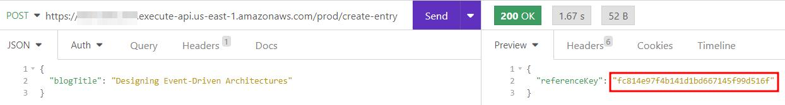

import { RodrigoProfileCard } from "@site/src/components/ProfileCardRodCab"
import { FigureCaption } from "@site/src/components/FigureCaption"
import { PersonQuote } from "@site/src/components/Quote"

# Store now, enrich later

:::info

This document explains the "Claim check" pattern, when you could use it and some examples when you
need to enrich a message or you face some service limits on AWS.

:::

<RodrigoProfileCard />

Today, we work with constantly changing systems, workflows, applications and clients so it's not
rare that we need to do an action, but we lack information to do it. On the other side, we may need
to upload or share a very large file or collection of data and we don't have the capacity to do it
all in just one shot.

When there are limitations on available information or the means we have to use to send that
information (time, size, etc.), we need to change the way we start those actions and the way we
finish them, in other words, reserve a spot and then use it. Services to decouple systems like
[Amazon SNS](https://aws.amazon.com/sns/), [Amazon SQS](https://aws.amazon.com/sqs/) or even
[Amazon API Gateway](https://aws.amazon.com/api-gateway/) have limits in the payload they can
receive, for example, if you try to send a message with a size of 5 MB in Amazon SNS
([check quotas](https://docs.aws.amazon.com/sns/latest/dg/large-message-payloads.html)) or Amazon
SQS
([check quotas](https://docs.aws.amazon.com/AWSSimpleQueueService/latest/SQSDeveloperGuide/quotas-messages.html)),
you will face service limits, same situtation you would face if you try to send a file/JSON with a
size of 50 MB to Amazon API Gateway
([check quotas](https://docs.aws.amazon.com/apigateway/latest/developerguide/limits.html)).

## Claim check explained

### Enriching a message

One of the main messaging transformation patterns used is the
[Content Enricher Pattern](https://www.enterpriseintegrationpatterns.com/patterns/messaging/DataEnricher.html),
the purpose of this pattern is that when a message doesn't have all the information needed, it will
be sent and we will get a reference, which will be used later to add information, "enrich", the
original message.

An example of a message that can be completed after it's been sent, is the credentials creation, in
case you need to validate your user name before setting a password, you send the message to create
the user and receive the reference to update the password later. Below, you can see an example in
Python:

```python showLineNumbers
# Simulate the credentials store
credentials_store: list = []

# A function to store new credentials that can lack password
def store_credentials(user: str, password: str = None):
    tmp_credentials: dict = {'user': user, 'password': password}

    credentials_store.append(tmp_credentials)

    # If the password is missing, return a reference to update it later
    if not password:
        print(f'Warning: Please update the password for user \'{user}\'\n')

        return tmp_credentials
    else:
        print(f'Info: Credentials for user \'{user}\' saved\n')

        return None

# Create complete credentials, we don't get a reference to update the password
complete_credentials = store_credentials('user1', 'password1')

# Watch the reference and the credentials store
print(f'Credentials reference: {complete_credentials}\nStore: {credentials_store}\n')

# Create incomplete credentials, we get a reference to update the password
incomplete_credentials = store_credentials('user2')

# Watch the reference and the credentials store
print(f'Credentials reference: {incomplete_credentials}\nStore: {credentials_store}\n')

# Update the password
incomplete_credentials['password'] = 'password2'

# Watch the reference and the credentials store
print(f'Credentials reference: {incomplete_credentials}\nStore: {credentials_store}\n')
```

If you execute the code, you will see an output like this:

```
Info: Credentials for user 'user1' saved

Credentials reference: None
Store: [{'user': 'user1', 'password': 'password1'}]

Warning: Please update the password for user 'user2' as soon as you can

Credentials reference: {'user': 'user2', 'password': None}
Store: [{'user': 'user1', 'password': 'password1'}, {'user': 'user2', 'password': None}]

Credentials reference: {'user': 'user2', 'password': 'password2'}
Store: [{'user': 'user1', 'password': 'password1'}, {'user': 'user2', 'password': 'password2'}]
```

### Filtering a message

In some occasions, we don't need to enrich a message, on the opposite, we need to filter its
content. To achieve this, we can use the
[Content Filter Pattern](https://www.enterpriseintegrationpatterns.com/patterns/messaging/ContentFilter.html)
so we can remove the data that will not be used, also, some systems have a size limit for the data
that can transits over them.

Maybe in some other occasions we will need the information we previously filtered on other parts of
the system, fir this we can store the full message and create a unique key to access the portion of
the data we need, when we need it and where we need it. Below, you can see an example in Python:

```python showLineNumbers
# Store the full message to be accessed from where we need information of it
full_message: dict = {
    'user': 'JeffBezos',
    'name': 'Jeff',
    'last_name': 'Bezos',
    'age': 55,
    'website_preferences': 'classic'
}

# Extract only the information the website configuration needs
website_configuration: dict = {
    key: full_message[key] for key in full_message.keys()
    & {'user', 'website_preferences'}
}

# Extract only the information the profile needs
profile_info: dict = {
    key: full_message[key] for key in full_message.keys()
    & {'name', 'last_name', 'age'}
}

# Watch how we can get the full message when we need it
print(f'Full message: {full_message}')

# Watch we can get only the website configuration when we need it
print(f'Website configuration: {website_configuration}')

# Watch we can get only the profile information when we need it
print(f'Profile information: {profile_info}')
```

If you execute the code, you will see an output like this:

```
Full message: {'user': 'JeffBezos', 'name': 'Jeff', 'last_name': 'Bezos', 'age': 55, 'website_preferences': 'classic'}
Website configuration: {'user': 'JeffBezos', 'website_preferences': 'classic'}
Profile information: {'age': 55, 'name': 'Jeff', 'last_name': 'Bezos'}
```

### Managing references

When we store first and enrich later, it's important to manage the reference, key or handler we will
use to upload, update, add, etc. the content over the initial request. Depending on the system we
are working, is the way we can manage the reference, for example, if we are working on a stateless
system, we should persist the reference in a database (Relational like
[Amazon RDS](https://aws.amazon.com/rds/), No-SQL like
[Amazon DynamoDB](https://aws.amazon.com/dynamodb/), In-Memory like
[Amazon Elasticache](https://aws.amazon.com/elasticache/) or
[Amazon MemoryDB](https://aws.amazon.com/memorydb/), etc.) or if we are working on a web
application, we have the option to store the reference using the
[Web Storage API](https://developer.mozilla.org/en-US/docs/Web/API/Web_Storage_API).

Forgetting or being unable to store the references may not cause errors in the system directly, but
if we have processes or systems that depend on the information we should enrich, the error could
appear later or even let the system in a unstable status. Below, you can see an example in Python:

```python showLineNumbers
# Library to generate unique identifiers
import uuid

# Simulate the information store
full_storage: dict = dict()

# A function to store the information in a pending status and return a reference
def storage_first(object: dict):
    reference = uuid.uuid4().hex

    full_storage[reference] = ['PENDING', object]

    return reference

# A function to enrich the original message and status according to its reference
def enrich_later(reference: str, new_object: dict):
    try:
        full_storage[reference][1].update(new_object)
        full_storage[reference][0] = 'OK'
    except KeyError as ke:
        return False

    return True

# First object to be stored
object1 = {"name": "John"}

# Store the first object
ref1 = storage_first(object1)

# Watch the store with the first object in pending status
print(f'Store: {full_storage}')

# Store the second object
object2 = {"name": "Jane"}

# Intentionally we don't store the reference
storage_first(object2)
# Should be this way
# ref2 = storage_first(object2)

# Watch the store with two objects in pending status
print(f'Store: {full_storage}')

# Enrich only the first object as we have no reference for the second object
enrich_later(ref1, {"age": 30})

# Watch the store with two objects, the first in OK status and the second in pending status
print(f'Store: {full_storage}')
```

If you execute the code, you will see an output like this, please note:

- The first object changes to OK status, while the second remains in the Pending status
- The references will vary between executions as they are unique

```
Store: {'ab65792be03444c9818bbb824db37bef': ['PENDING', {'name': 'John'}]}
Store: {'ab65792be03444c9818bbb824db37bef': ['PENDING', {'name': 'John'}], '30b7160209bf46d8b111d5a2033af391': ['PENDING', {'name': 'Jane'}]}
Store: {'ab65792be03444c9818bbb824db37bef': ['OK', {'name': 'John', 'age': 30}], '30b7160209bf46d8b111d5a2033af391': ['PENDING', {'name': 'Jane'}]}
```

## Why to use Claim check pattern

### Don't delay the inevitable

When you know you have to send, notify or store incomplete information, or, on the other hand, you
have a payload which size is larger than limits the service you want to use; you may want to wait
until you have all the information or in the worst case, you could search another way to send the
information that supports the payload size you have.

With
[Claim Check Pattern](https://www.enterpriseintegrationpatterns.com/patterns/messaging/StoreInLibrary.html)
you can start to send your message with incomplete information or to get a reference to upload a
payload the service you are using doesn't support as soon as you detect this message. For example,
you can "store now" your messages from web and mobile applications, IoT devices or other private
connected users and applications using [Amazon API Gateway](https://aws.amazon.com/api-gateway/):


<FigureCaption>Fig 1. Amazon API Gateway sources</FigureCaption>

for the same purpose you can count on [Amazon SNS](https://aws.amazon.com/sns/):


<FigureCaption>Fig 2. Amazon SNS sources</FigureCaption>

and [Amazon SQS](https://aws.amazon.com/sqs/):


<FigureCaption>Fig 3. Amazon SQS sources</FigureCaption>

An example of this is shown in
[Solution: Claim check to add message information in a blog](#solution-claim-check-to-add-message-information-in-a-blog)

### Achieve great things, little by little

When you have a message (or even a file) larger than the supported size by your broker or service,
you could think of strategie like cut your message or file in multiple parts to fit the size
supported by your broker or service, but this brings new challenges like how to rebuild the final
message or file, or even worse, detect if some part of the original message or file didn't reach the
broker or service.

To avoid facing extra challenges, you can reserve the space where you can upload the big message or
file, get a reference or unique key, as it was said previously, and finally, when you have the
capacity, upload your content using that reference.

## Solution: Claim check to add message information in a blog

This solutions shows an example of how we can apply the Claim check pattern to a blog. Let's imagine
you have a topic you want to write about and develop, but you only have vague ideas about it, but
also you don't want to forget it or waste your team's effort if other of your colleagues starts to
write about the same topic.

In this case, you will "reserve your spot" sending just the blog's title and getting a reference/key
to add the blog's content later, whit this, your team will be aware someone else is writing about
the topic wen will use their effort to write about something else.

### Solution: Sequence

In the following diagram, you can see how the Client (the initiator), Amazon API Gateway (the front
door), [AWS Lambda](https://aws.amazon.com/pm/lambda/) (the compute layer) and Amazon DynamoDB (the
persistence layer) interact to accomplish the task of creating the blog's title to adding content to
that blog's entry.


<FigureCaption>Fig 4. Sequence diagram of the solution</FigureCaption>

> Create the message - Store First

1. The client initiates the process sending to Amazon API Gateway the original message, in this
   case, the blog's entry title
2. Amazon API Gateway passes the information received from the client
3. AWS Lambda generates the reference/key that will be stored in Amazon DynamoDB
4. AWS Lambda stores the reference/key along the blog's entry title in DynamoDB, at this moment, the
   blog's entry exists, but without any content
5. Amazon DynamoDB returns the confirmation to AWS Lambda to inform a successful operation
6. AWS Lambda passes the reference/key to Amazon API Gateway, like in the request
7. Amazon API Gateway returns the response to the client to inform successful entry creation

> Waiting time

1. The client can complete the tasks offline, gather the information they need and be prepared to
   enriche the original message

> Complete/add information to message - Enrich Later

1. The client initiates the process sending to Amazon API Gateway the content to enrich the original
   message, in this case, the blog's content, additionally, the client sends the reference/key to
   know what blog's entry the system have to update
2. Amazon API Gateway passes the information received from the client
3. AWS Lambda updates de blog's content using the reference/key in Amazon DynamoDB, at this moment,
   the blog's entry is complete
4. Amazon DynamoDB returns the confirmation to AWS Lambda to inform a successful operation
5. AWS Lambda passes the operation confirmation to Amazon API Gateway
6. Amazon API Gateway returns the response to the client to inform successful update and finish the
   process

### Solution: Create the message - Store First

We initiate the process sending the blog's title to Amazon API Gateway and getting the reference/key
(marked in red):

**POST /create-entry**

Request:

```json
{
  "blogTitle": "Designing Event-Driven Architectures"
}
```

Response:

```json
{
  "referenceKey": "fc814e97f4b141d1bd667145f99d516f"
}
```



<FigureCaption>Fig 5. Sending the original message - Store First</FigureCaption>

You can see the code that's executed in AWS Lambda to generate, store and return the reference/key:

```python showLineNumbers
# Library to use AWS SDK clients
import boto3

# Library to generate Universal Unique IDentifiers
import uuid

# DynamoDB client to write to the database
client_dynamodb = boto3.client('dynamodb')

# DynamoDB table name to write the information
# it's a best practice to extract the name into an environmental variable
dynamodb_claim_check_table = 'claim-check-blog'

# Function AWS Lambda will call after Amazon API Gateway
# receives the original message
def lambda_handler(event, context):
    blog_title = event.get('blogTitle')

    if blog_title:
        # Generate the reference/key
        reference_key = uuid.uuid4().hex

        # Write the reference/key to the database along the blog's title
        client_dynamodb.put_item(
            TableName=dynamodb_claim_check_table,
            Item={
                'reference-key': {
                    'S': reference_key
                },
                'title': {
                    'S': blog_title
                }
            }
        )

        # Return the reference/key to Amazon API Gateway
        return {
            'referenceKey': reference_key
        }
    else:
        return {
            'referenceKey': None
        }
```

and you can see how the entry is stored in Amazon DynamoDB, its reference/key (marked in red) and
title, without any content:


<FigureCaption>Fig 6. Blog's entry in Amazon DynamoDB</FigureCaption>

As an optional step, we can check the entry's information with its reference/key using another
endpoint:

`GET /read-entry/{referenceKey}` -> `GET /read-entry/fc814e97f4b141d1bd667145f99d516f`

Response:

```json
{
  "entry": {
    "referenceKey": "fc814e97f4b141d1bd667145f99d516f",
    "title": "Designing Event-Driven Architectures",
    "content": null
  }
}
```


<FigureCaption>Fig 7. Checking the incomplete message</FigureCaption>

You can see the code that's executed in AWS Lambda to read the entry from Amazon DynamoDB:

```python showLineNumbers
# Library to use AWS SDK clients
import boto3

# DynamoDB client to write to the database
client_dynamodb = boto3.client('dynamodb')

# DynamoDB table name to read the information
# it's a best practice to extract the name into an environmental variable
dynamodb_claim_check_table = 'claim-check-blog'

# Function AWS Lambda will call after Amazon API Gateway
# receives the read request
def lambda_handler(event, context):
    reference_key = event.get('referenceKey')

    try:
        if reference_key:
            # Read the entry from Amazon DynamoDB database
            result = client_dynamodb.get_item(
                        TableName=dynamodb_claim_check_table,
                        Key={
                            'reference-key': {
                                'S': reference_key
                            }
                        }
                    )

            # Return the information read from database
            return {
                'entry': {
                    'referenceKey': result['Item']['reference-key']['S'],
                    'title': result['Item']['title']['S'],
                    'content': result['Item'].get('content')['S'] if result['Item'].get('content') else None
                }
            }
        else:
            raise Exception
    except:
        return {
                'entry': None
        }
```

### Solution: Complete/add information to message - Enrich Later

We finish the process sending the blog's content using the reference/key we got previously:

**POST /update-entry**

Request:

```json
{
  "referenceKey": "fc814e97f4b141d1bd667145f99d516f",
  "blogContent": "Lorem ipsum dolor sit amet, consectetur adipiscing elit, sed do eiusmod tempor incididunt ut labore et dolore magna aliqua. Ut enim ad minim veniam, quis nostrud exercitation ullamco laboris nisi ut aliquip ex ea commodo consequat. Duis aute irure dolor in reprehenderit in voluptate velit esse cillum dolore eu fugiat nulla pariatur. Excepteur sint occaecat cupidatat non proident, sunt in culpa qui officia deserunt mollit anim id est laborum."
}
```

Response:

```json
{
  "referenceKey": "fc814e97f4b141d1bd667145f99d516f",
  "status": "OK"
}
```


<FigureCaption>Fig 8. Updating the blog's entry content - Enrich Later</FigureCaption>

You can see the code that's executed in AWS Lambda to update the entry in Amazon DynamoDB:

```python showLineNumbers
# Library to use AWS SDK clients
import boto3

# DynamoDB client to write to the database
client_dynamodb = boto3.client('dynamodb')

# DynamoDB table name to write the information
# it's a best practice to extract the name into an environmental variable
dynamodb_claim_check_table = 'claim-check-blog'

# Function AWS Lambda will call after Amazon API Gateway
# receives the new content for the message
def lambda_handler(event, context):
    reference_key = event.get('referenceKey')
    blog_content = event.get('blogContent')

    if reference_key:
        # Update the entry in Amazon DynamoDB using the reference/key
        res = client_dynamodb.update_item(
            TableName=dynamodb_claim_check_table,
            ExpressionAttributeNames={
                '#C': 'content'
            },
            ExpressionAttributeValues={
                ':c': {
                    'S': blog_content
                }
            },
            ReturnValues='ALL_NEW',
            UpdateExpression='SET #C = :c',
            Key={
                'reference-key': {
                    'S': reference_key
                }
            }
        )

        # Return the confirmation to Amazon API Gateway
        return {
            'referenceKey': reference_key,
            'status': 'OK'
        }
    else:
        return {
            'referenceKey': None,
            'status': 'ERROR'
        }
```

and you can see how the entry is updated in Amazon DynamoDB, its reference/key (marked in red),
title and the new content:


<FigureCaption>Fig 9. Updated blog's entry in Amazon DynamoDB</FigureCaption>

As an optional step, we can check the entry's information:

`GET /read-entry/{referenceKey}` -> `GET /read-entry/fc814e97f4b141d1bd667145f99d516f`

Response:

```json
{
  "entry": {
    "referenceKey": "fc814e97f4b141d1bd667145f99d516f",
    "title": "Designing Event-Driven Architectures",
    "content": "Lorem ipsum dolor sit amet, consectetur adipiscing elit, sed do eiusmod tempor incididunt ut labore et dolore magna aliqua. Ut enim ad minim veniam, quis nostrud exercitation ullamco laboris nisi ut aliquip ex ea commodo consequat. Duis aute irure dolor in reprehenderit in voluptate velit esse cillum dolore eu fugiat nulla pariatur. Excepteur sint occaecat cupidatat non proident, sunt in culpa qui officia deserunt mollit anim id est laborum."
  }
}
```


<FigureCaption>Fig 10. Checking the complete message</FigureCaption>

At this point, we already sent a message with incomplete information and, after that, we sent the
missing information to complete our blog's information.

### Solution: Summary

As yo can see, applying the Claim check pattern to enriching messages can be easy if you design it
since the beginning, but it doesn't mean you can't add later to your project or architecture, you
just have to consider how the systems that depends on this information will be affected and work
backwards from that point.

#### Architectural Diagram

You already saw the sequence of interactions, the parts of the system individually and last, but not
least, here is the Architectural Diagram:


<FigureCaption>Fig 11. Architectural Diagram</FigureCaption>

1. The applications can connect to the front door, in this case, Amazon API Gateway, which can then
   route the requests to multiple targets
   - The applications can use private connections, SDK or API calls, Amazon API Gateway is just an
     option
2. One of the targets Amazon API Gateway can route our request is, in this case, AWS Lambda, to
   process the message (or the incomplete message fro the case of Claim check pattern)
3. AWS Lambda process our request and can perform multiple operations, in this case, it generates a
   reference/key which is stored in Amazon DynamoDB
   - AWS Lambda and Amazon DynamoDB are just options for compute and No-SQL databsae, the
     architecture can work with any other alternatives

It's important to note that every action in the architecture is driven by an event, from the
beginning, when the client informs that hey need to create a blog's entry, but don't have the
content, after some time that can be very quick or a considerable amount of time, the client trigger
another event to update the blog's entry. While the client is gathering the information they need,
the architecture and the infrastructure don't have to process anything and this is a very notable
feature of this type of designs, this makes it efficient and cheap (in most cases).

#### Advantages

- We don't have to wait to have all the information we need to start working
- This pattern enables us to add gradually content to previously sent messages
- We can have a reference/key multiple systems can leverage to interact as soon as they have the
  data required to continue with its processes without representing a bottleneck to the entire
  workload

#### Disadvantages

- As this pattern enables you to start sending messages early, this same feature implies that you
  have to be aware of those systems that depends on the sent information or the lack of it
- You need to identify very clearly all the inter-dependencies between your different systems or
  components
- The capacity to let the information to enrich our messages later doesn't mean that we have a
  license to let the system in an unstable status, so we need to have special care on this

## Resources

If you want to go deeper in this topic, you can review the following resources and don't forget...

<PersonQuote author="Amazon Leadership Principles">Learn and Be Curious</PersonQuote>

### Course: Skill Builder "Designing Event-Driven Architectures"

[AWS Skill Builder](https://skillbuilder.aws/) is a great place to learn for free about multiple
topics, including
[Designing Event-Driven Architectures](https://explore.skillbuilder.aws/learn/course/internal/view/elearning/12715/designing-event-driven-architectures)

### Web: Serverlessland Claim check

Serverless services on AWS and Event-Driven Architectures (EDA) are very good friends so you should
check [Serverless Land](https://serverlessland.com/) where you can find a lot of great curated
content about Serverless, but also these technologies applied to EDA in
[Claim check pattern visuals](https://serverlessland.com/event-driven-architecture/visuals/claim-check-pattern)
and some other implementations with
[Amazon S3 and Amazon EventBridge](https://serverlessland.com/patterns/s3-to-eventbridge-claim-check-pattern)

### Book: Enterprise Integration Patterns

A book will always be our ally during our learning, you can check
[Enterprise Integration Patterns](https://www.enterpriseintegrationpatterns.com/) and check this
specific
[chapter](https://www.enterpriseintegrationpatterns.com/patterns/messaging/StoreInLibrary.html)
