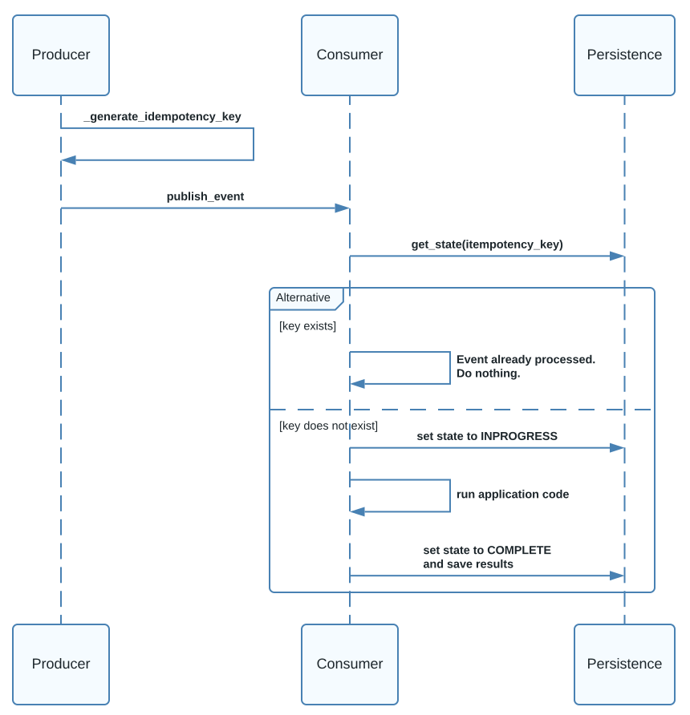

import { FigureCaption } from "@site/src/components/FigureCaption"
import { PersonQuote } from "@site/src/components/PersonQuote"
import { BrianProfileCard } from "@site/src/components/ProfileCard"

# How to handle duplicate events

:::info

This document explains idempotency, why it matters, and how to design for it when using event and
message message brokers on AWS.

:::

<BrianProfileCard />

Processing or receiving a single message multiple times is a possibility with many modern-day event
and message brokers. Push-based services like
[Amazon EventBridge](https://aws.amazon.com/eventbridge/foobar) and
[Amazon Simple Notification Service (SNS)](https://aws.amazon.com/sns/) offer at-least-once delivery
semantics. This means it's possible for consumers to receive a message more than once. In pull-based
systems like [Apache Kafka](https://kafka.apache.org/),
[Amazon Managed Streaming for Kafka (MSK)](https://aws.amazon.com/msk/) and
[Amazon Kinesis](https://aws.amazon.com/kinesis/), it's possible for an event producer to publish a
message multiple times. Another possible is that consumers read and/or process a single message
multiple times because of a bug, transient error, or something else.

Regardless of your preferred broker technology, consumers should have the ability to identify
duplicate messages and handle them without adverse consequences.
[Idempotence](https://en.wikipedia.org/wiki/Idempotence) is a property in mathematics and computer
science where a single operation can be applied multiple times without changing the final result. In
distributed system this translates to not changing the state of a system unintentionally, when a
message is processed more than once.

## Idempotency explained

### Idempotent operations

Examples of idempotent operations are addition or multiplication. Consider a system that takes an
order total as input, and calculates the total tax to apply using a fixed tax rate of 5%.

```python showLineNumbers
def calculate_tax(order_total: float) -> float:
    return order_total * 0.05

amt = 105.5

print(f"Order amount: ${amt}, tax: ${calculate_tax(amt)}")
print(f"Order amount: ${amt}, tax: ${calculate_tax(amt)}")
print(f"Order amount: ${amt}, tax: ${calculate_tax(amt)}")
```

```
Order amount: $105.5, tax: $5.275
Order amount: $105.5, tax: $5.275
Order amount: $105.5, tax: $5.275
```

Given the same input, the `tax` result is the same regardless of how many times it's calculated. The
`calculate_tax` function is said to be idempotent.

### Non-idempotent operations

On the other hand, imagine a bank account that has a running balance. What happens when we
accidentally make the same deposit twice?

```python showLineNumbers
class Account:

    def __init__(self, opening_balance=0):
        self.balance = opening_balance

    def deposit(self, amt: float) -> None:
        self.balance += amt

    def withdraw(self, amt: float) -> None:
        if amt > self.balance:
            raise Exception(f"Not enough funds to withdraw {amt}")
        self.balance -= amt

account = Account()

amt = 19.99

print(f"Depositing ${amt}")
account.deposit(amt)
print(f"Account balance: ${account.balance}")

print(f"Depositing ${amt}")
account.deposit(amt)
print(f"Account balance: ${account.balance}")
```

Depositing the same amount multiple times changes the account balance. The `deposit` and `withdraw`
operations are _not_ idempotent because each call changes the state of the system.

```
Depositing $19.99
Account balance: $19.99

Depositing $19.99
Account balance: $39.98
```

## Why idempotency matters

The animation below demonstrates how a message is received, but the acknowledgment is lost due to a
network failure. In this case, a sender configured with retry logic will send the message again
which results in duplicate processing.

<PersonQuote
  author="Werner Vogels, AWS CTO"
  url="https://www.allthingsdistributed.com/2016/03/10-lessons-from-10-years-of-aws.html"
>
  Everything fails all the time.
</PersonQuote>


<FigureCaption>Fig 1. Failures between event producers and consumers</FigureCaption>

Duplicate delivery and processing are facts of life in distributed systems. Idempotency matters
because:

- There is no guarantee that a message will be delivered exactly once.
- There is no guarantee that a consumer will process a message exactly once.
- Many operations within a system create side effects. An event consumer often changes the state of
  a system in response to an event. Processing the same event more than once can lead to unintended
  side effects.

Architects need to implement solutions in consumers to identify messages they've already processed.
Once a consumer can identify an already processed message, it can decide what to do (ignore,
reprocess, recover, etc.).

:::info

If you would like to learn more about the fundamental challenge of idempotency in distributed
systems and how it's a fundamental challenge in computer science, watch <strong>0x9 - Distributed
Systems Engineering: Idempotency</strong> from AWS VP/Distinguished Engineer Colm MacCárthaigh.

<iframe
  width="560"
  height="315"
  src="https://www.youtube.com/embed/Jxugill-rOM?si=YZ04rfib9Lkyopob"
  title="YouTube video player"
  frameborder="0"
  allow="accelerometer; autoplay; clipboard-write; encrypted-media; gyroscope; picture-in-picture; web-share"
  allowfullscreen
></iframe>

:::

## Solution: using an idempotency key

The solution that makes an event consumer idempotency is using an idempotency token (also known as
an idempotency key). Idempotency tokens uniquely identify messages to enable receivers to avoid
duplicate processing and unintended side effects. The data consumer uses the token along with a
persistent data store, to determine the state of and event.

The idempotency key is nothing special other than a unique identifier, typically in the form of a
[UUID](https://en.wikipedia.org/wiki/Universally_unique_identifier) or a
[hash](https://en.wikipedia.org/wiki/MD5) of some or all of the event payload. Because this solution
is based on the uniqueness of an idempotency token, _it's critical that any implemenation guarantee
token uniqueness_. When creating payload-based idempotency tokens, _it's critical that the token
generation use a [determinisic algorithm](https://en.wikipedia.org/wiki/Deterministic_algorithm)_.

:::note

In this example, the message broker (EventBridge, Kafka, etc.) is not shown for simplicity. In a
real distributed application the `publish_event` call would publish a message to a broker. Once the
consumer receives the message it would complete the steps shown in the example.

Also note, because this is a fire and forget processing model that mimics an event-driven
architecture, the consumer doesn't return a response to the event producer. Background procesing and
fire and forget, where a client does not receive or wait for a response, are halmarks of
event-driven architectures.

:::

### Solution: Sequence



<FigureCaption>Fig 2. Sequence diagram when using an idempotency key in EDA</FigureCaption>

The Python code below shows how idempotency keys work at a conceptual level. This example code uses
an in-memory data structure for simplicity. In a production deployment, a durable state store with
strong consistency would be used. The overall flow in the code and sequence diagram is:

1. Data producer creates a unique `idempotency_key` and adds it to the event payload.
1. Data producer publishes the event payload.
1. The consumer extracts `idempotency_key` and uses it to lookup the state in the persistence layer.
1. If the key exists in the persistence layer, stop.
1. If the key does not exist in the persistence layer, set the current state to `INPROGRESS`
1. Run the application code to process the event
1. Set the state to `COMPLETE` and save the application code output using the `idempotency_key`

### Solution: Implementation notes

A good idempotency token implementation will include additional functionality, such as:

- **Expiration**: Use a time duration where the idempotency key is active, meaning side effects
  won't occur within that time range
- **Consistent read/writes**: ensure there are no race conditions when reading/writing from/to the
  data store. Use database read/write consistency mechanisms so that only a single processor
  executes where two or more are running in parallel.
- **Token generation choices**: Tokens should be generated in one of two ways: randomly by the data
  producer or based on the message payload, by producer or consumer.
  - If using a random idempotency token:
    - The token will be created by the data producer and used by the consumer.
    - A `UUID` is a good choice when creating a random token from the data producer.
  - If generating the token by payload:
    - Either the data producer or consumer will generate the token, since it's based on the event
      payload. Any algorithm to generate a payload-based token _must be
      [deterministic](https://en.wikipedia.org/wiki/Deterministic_algorithm) so that a given input
      always produces the same output._
    - Payload-based token generation doesn't work well when duplicate events are a normal part of
      your application. Some business use cases may require you to send and process an event with
      the same payload multiple times. Other messages, like IoT sensor data, are inherently unique
      and don’t need to be sent more than once. In the later case, payload-based token generation is
      a safe option.
  - Regardless of how tokens are generated, the producer and consumer must agree on the payload
    contract and use the same logic to encode/decode the token.

### Solution: Example implemenation

```python showLineNumbers
import hashlib

from typing import Optional, Dict

from dataclasses import dataclass

NOTSTARTED = "NOTSTARTED"
INPROGRESS = "INPROGRESS"
COMPLETED = "COMPLETED"


@dataclass
class EventState:
    status: str
    idempotency_key: str
    results: Optional[dict] = None

    def is_inprogress(self):
        return self.status == INPROGRESS

    def is_completed(self):
        return self.status == COMPLETED


IN_MEMORY_DATASTORE: Dict[str, EventState] = {}


def _generate_idempotency_key(data):
    return hashlib.md5(str(data).encode("utf-8")).hexdigest()


def generate_user_payload(data):
    # Step 1. The client generates the idempotency key and adds it to the event payload.
    idempotency_key = _generate_idempotency_key(data)
    return {"data": data, "metadata": {"idempotency_key": idempotency_key}}


def process_user_event(event: dict):
    data = event["data"]
    # Step 3. The consumer extracts the idempotency_key
    idempotency_key: str = event["metadata"]["idempotency_key"]

    # Step 3. Fetch event state from data store
    event_state = _fetch_event_state(idempotency_key)

    # Step 4. If the key exists in the data store, stop
    if event_state.is_inprogress():
        raise Exception("Event in progress")
    elif event_state.is_completed():
        print("Event already completed. Returning results.")
        return event_state.results

    # Step 5. When the key doesn't exist, mark the event state as in progress in the data store
    _persist_event_state(event_state, INPROGRESS)

    # Step 6. Run the application code/business logic
    results = run_business_logic(data)

    # Step 7. Save the results and mark this event state as completed and persist
    _persist_function_results(event_state, results)

    return event_state.results


def _fetch_event_state(idempotency_key: str) -> EventState:
    return IN_MEMORY_DATASTORE.get(idempotency_key) or EventState(
        NOTSTARTED, idempotency_key
    )


def _persist_event_state(event_state: EventState, status: str) -> None:
    event_state.status = status
    IN_MEMORY_DATASTORE[event_state.idempotency_key] = event_state


def _persist_function_results(event_state: EventState, results: dict) -> None:
    event_state.results = results
    _persist_event_state(event_state, COMPLETED)


def run_business_logic(data: dict) -> dict:
    # This would run your application logic. In this example, just return the data.
    return data


if __name__ == "__main__":
    data_items = [
        {
            "name": "John Smith",
            "age": 45,
            "city": "New York",
            "country": "USA",
            "job": "Software Engineer",
        },
        {
            "name": "Jane Doe",
            "age": 30,
            "city": "Seattle",
            "country": "USA",
            "job": "Engineering Manager",
        },
    ]

    for data in data_items:
        # Step 1. Prepare the payload
        event = generate_user_payload(data)
        # Step 2. Note there is no step 2 since this example code doesn't
        # need to publish. If there was an event broker the publish step
        # would be here.

        # Steps 3-7. This function wraps what happens within the data
        # consumer. In a real distributed system, this would be a
        # different process.
        # Call this twice to show how the event is only processed once.
        process_user_event(event)
        process_user_event(event)

```

### Solution: Summary

#### Advantages

- Offers fine-grained control over the identification of a unique event
  - It's easy to implement custom logic to identify a unique event
- Allows for complete control over expiration/TTL of idempotency keys
  - Most implementations will not store idempotency keys and results indefinitely. When implementing
    your own solution you have complete control over how to expire results.
- Flexible
  - Because you own the implementation you can tailor it to your needs from the code to the data
    store.
  - Custom implementations should be reusable between workloads.
  - Still, implementations should be fairly simple and easy to reuse amongst other workloads.
  - This pattern is application for any workload, regardless of the event broker.

#### Disadvantages

- Additional code and infrastructure to own and maintain
  - There will be additional costs associatedS with any data stores to persist results. Performant
    NoSQL data stores like DynamoDB and Redis are good choices, but you must consider performance,
    scaling and quotas.
- Possible reduced throughput
  - Data store reads and writes can add additional latency. Choose and optimize a data store
    carefully to reduce performance penalties.

## Option: deduplication by the broker

Some message brokers like Apache Kafka and
[Amazon SQS FIFO queues](https://docs.aws.amazon.com/AWSSimpleQueueService/latest/SQSDeveloperGuide/FIFO-queues.html)
offer exactly once delivery semantics. This means that a message from the producer is guaranteed to
arrive on the stream or queue, respectively, exactly once, even if the producer publishes the
message multiple times.

It's tempting to see exactly-once delivery guarangees available in your broker of choice and
delclare idempotency solved. However, having guaranteed unique messages on the broker is only part
of the solution. It's still possible (and common) for data _consumers_ to read a message multiple
times. This is especially true in streaming systems like Kafka where a message remains on the stream
after its been read vs. queues where a message is deleted after successful processing.

While exactly-once delivery semantics help, you still need to consider and handle duplicate
_processing_. Additionally, some message brokers have a time contraints with their exactly-once
guarantees.

- Amazon SQS (FIFO) SendMessage 5 minutes
- Amazon SNS (FIFO) Publish 5 minutes

The AWS Lambda Powertools idempotency utilities referenced belows defaults to one hour. However,
it's possible to configure the time range to a longer or shorter time period.

## Resources

[Powertools for AWS Lambda](https://docs.powertools.aws.dev/lambda/python/latest) offers a robust
implementation of the idempotency design explained above. When building systems on AWS Lambda, this
is the fastest and easiest way to make data processing functions idempotent.

Refer to the idempotency sections for the Powertools implementation for your preferred programming
language:

- [Idempotency for Python](https://docs.powertools.aws.dev/lambda/python/latest/utilities/idempotency/)
- [Idempotency for TypeScript](https://docs.powertools.aws.dev/lambda/typescript/latest/utilities/idempotency/)
- [Idempotency for Java](https://docs.powertools.aws.dev/lambda/java/utilities/idempotency/)
- [Idempotency for .NET](https://docs.powertools.aws.dev/lambda/dotnet/utilities/idempotency/)
