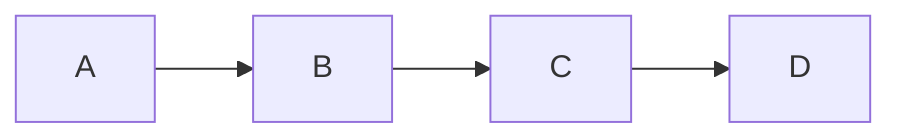
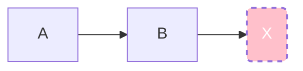
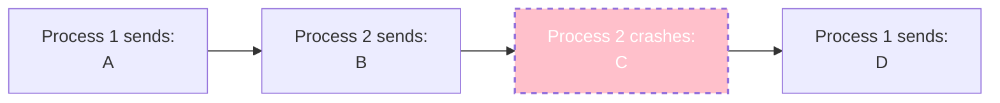
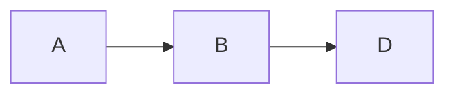
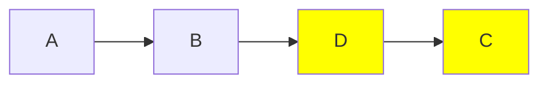
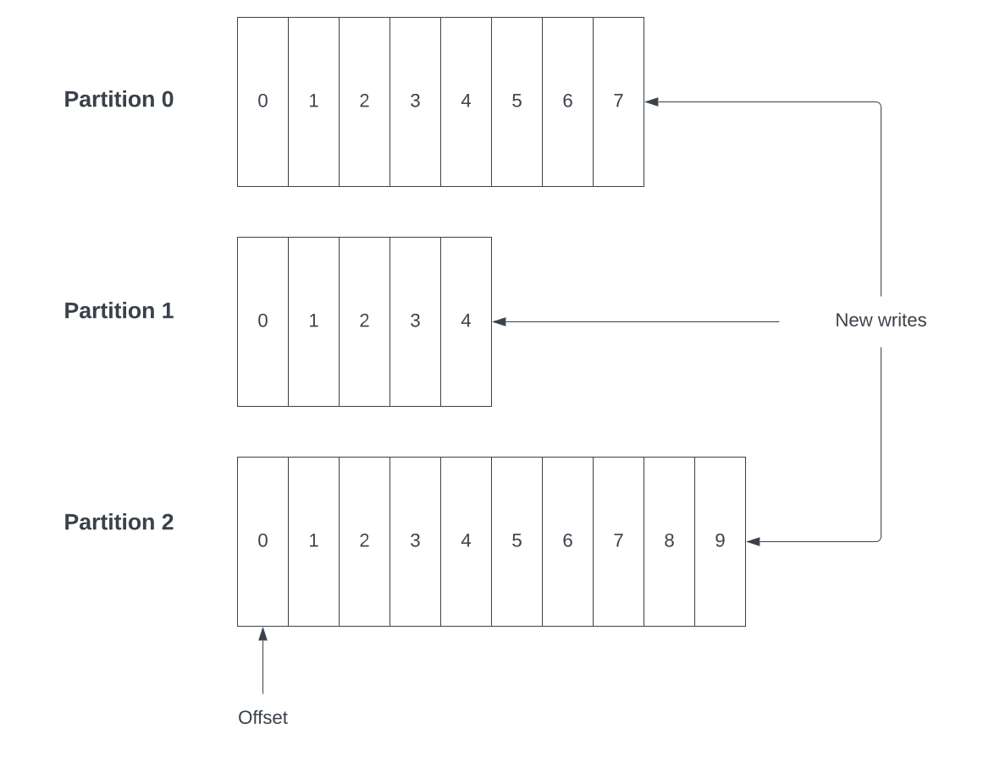
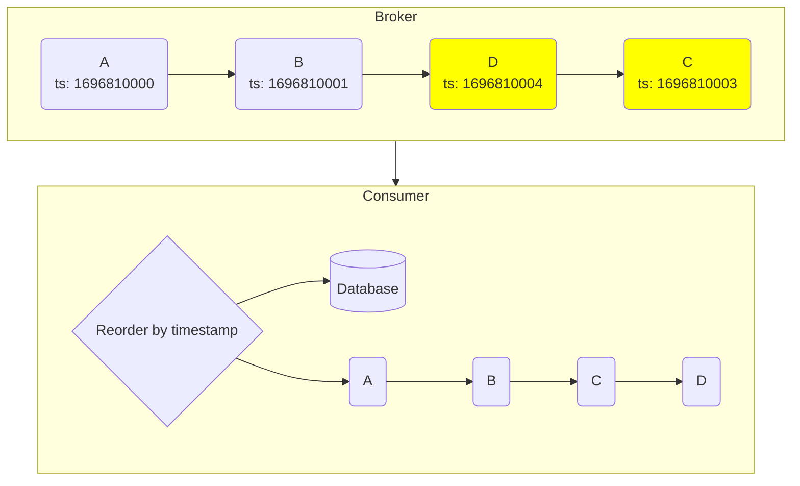
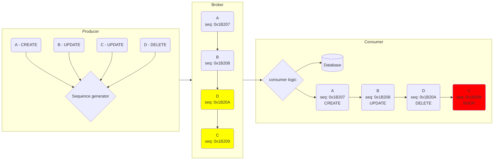

{/* Copyright Amazon.com, Inc. or its affiliates. All Rights Reserved. */}
{/* SPDX-License-Identifier: CC-BY-SA-4.0 */}

import { FigureCaption } from "@site/src/components/FigureCaption"
import { PersonQuote } from "@site/src/components/PersonQuote"
import { BrianProfileCard } from "@site/src/components/ProfileCard"

# How to handle ordering of events

:::info

This document explains message ordering when using message brokers, why it difficult, and how many
applications can work around ordering by message broker.

:::

<BrianProfileCard />

Message ordering in event-driven architectures is often requested and rarely well-understood. Just
like exactly-once processing, message ordering is a challenge to achieve in distributed systems.

The first question is: what exactly is in-order message delivery? In this document we define
messaging ordering as a messages being stored in a message broker in the same order as they were
published. For push-based message brokers like Amazon EventBridge and Amazon SNS, ordered messaging
means that clients receive messages in teh same order they were published.

## Ordering explained

### Within a single process

Forget distributed systems for a moment and imagine a single process, running on a single host, in a
single thread (the data producer). That single process does some work, and sends messages to another
process running on the same hosts (the data consumer). The data producer sends four events (`A`,
`B`, `C` and `D`) to the consumer in order. Both producer and consumer expect and depend on this
ordering shown below.

When the producers crashes while, or before, publishing event `C`, the consumer will never receive
events `C` _or_ `D`. Because a single-threaded process on a single host is responsible for producing
messages, there is a guarantee that events will be published in the correct order.

The producer should implement a mechanism to keep track of which messages it has published that can
handle application restarts. In that case, it's easy to pickup where it left off and begin
publishing the unpublished events once the producer recovers. The data producer will then publish
`C` and `D`, as expected. Other than a brief period of silence, the consumer doesn't notice any
difference.

### Across multiple processes

Life isn’t as easy in a distributed system. Imagine that producers are spread across the network in
different processes. These producers may be the same container image running in different pods,
multiple Lambda execution environments, or multiple processes running across EC2 hosts in an auto
scaling group.

With 2, 3...`n` producers sending data to a message broker across a network, how can you _guarantee_
that two systems running independently have published their messages in the correct order? The
answer is that you cannot. Imagine the same scenario as above where a process that is publishing a
message crashes. But now, there are multiple processes publishing messages independently.

`Process 1` and `Process 2` are unaware of each other and have no idea of each other's state. When
`Process 2` crashes, it doesn't send message `C`. `Process 1` is happily unaware of this fact, and
continues publishing its messages. The message broker will be missing event `C`, since `Process 1`
has crashed and `Process 2` is healthy:

Later, `Process 2` recovers, picks up from where it left off, and publishes event `C`. This results
in the following messages on the message broker.

It's clear that messages `C` and `D` are out of order from a _logical_ perspective. However, the
messages are ordered _physically_ because they are stored in the order in which they were received.

:::caution Important

**_Logical ordering_** and **_physical ordering_** of messages is different. Logical ordering is
application-specific, and is defined by your business needs. Physical ordering refers to how
messages are stored and arranged within a message broker. Messages may be physically ordered but not
logically ordered.

:::

### Ordering guarantees in streams

Many message brokers such as Apache Kafka and Amazon Kinesis will guarantee ordering within a given
partition or shard, respectively. Streaming systems like these use append-only write semantics, so
every message is appended to the end stream in the order that it's received.

To increase throughput, streaming systems scale by adding more partitions (or, shards). However,
once messages are distributed amongst multiple physical data stores (partitions or shards), reading
data in order is not guaranteed. A message will be stored on one of multiple partitions, not
accounting for replication across physical hosts. Because streams use a pull-based model for data
retrieval, clients would need to know from what partition to read each message so that they can
process messages in the right order.

<FigureCaption>
  Fig 1. Example of how streaming systems scale, and offer ordering within a single partition or
  shard.
</FigureCaption>

:::important

There is an inherent trade-off between ordering and performance in streaming systems. Using a
_single_ partition or shard guarantees ordering with the trade-off of decreased throughput. Using
_multiple_ partitions or shards increases throughput, but cannot guarantee logical ordering in a
software application.

:::

### Ordering guarantees in queues

Ordering in queues is similar to _Figure 1_. Many queueing technologies provide ordering guarantees
within a single queue or topic. Other queueing services like SQS standard queues favor performance
over ordering, and provide best-effort ordering. This trade off is the reason tthat SQS standard
queues support
[nearly unlimited requests per second](https://docs.aws.amazon.com/AWSSimpleQueueService/latest/SQSDeveloperGuide/quotas-messages.html)
for both read and write.

Another version of SQS, SQS FIFO queues, support ordering with a trade off of reduced TPS. SQS FIFO
queues can also offer exactly-once processing due to the same trade-offs that allow for ordering.

For some perspective in trade-offs between ordering guarantees and throughput, consider the the FIFO
queues can read 3,000 messages per second when using batching, while standard SQS queues do not have
an upper-bound in TPS.

:::caution

Relative TPS quotas are used here to describe the trade-off between scale and ordering guarantees.
Quotas for AWS services like SQS are dependent on region and other factors. When making decisions on
services by quota, ensure you consider all factors applicable to your workload.

:::

### The allure of guaranteed ordering

Builders often see FIFO/ordering guarantees available for a particular message broker and consider
the problem of ordering solved. Ordering guarantees are attractive but are never a silver bullet.

Consider the fact that even when using a broker with ordering guarantees, message order is
guaranteed for messages that the broker _receives_. When a producer crashes, pauses or otherwise
fails to publish an event, subsequent events from different brokers may still be published. In our
example, a FIFO queue or single partition topic could still end up with the messages
`A -> B -> C -> D`. You have ordering as far as your middleware is concerned, but it’s the wrong
order for your application.

:::important

Understand the difference between **_physical ordering_** and **_logical ordering_**. Builders are
often confused by this subtle yet important difference that leads them to making the wrong decisions
for their use cases.

:::

## Solution: Reordering by timestamp {#reorder-by-timestamp}

Because it's impractical to guarantee ordering in a distributed system, builders can implement
reordering in message consumers, or as a component within an EDA.

### Solution: Implementation notes {#reorder-by-timestamp-notes}

A simple solution to ordering is to publish messages with the UTC timestamps when data producers
sent their messages. A prerequisite with this strategy is that each data producer has a synchronized
system clock. Systems like [NTP](https://en.wikipedia.org/wiki/Network_Time_Protocol) makes this
easier.

Reordering by timestamp in a message payload attractive because it will work across message brokers
and is easy to implement and understand. A disadvantage is that this reordering logic would need to
be repeated across consumers, which may feel like additional overhead. While duplication of code and
logic comes at a cost, sorting items by timestamp is simple enough to warrant the tradeoff. In an
event-driven architecture there may be consumers who are not concerned with ordering and will choose
to not implement it. This is the type of flexibility EDAs offer.

### Solution: Implementation diagram {#reorder-by-timestamp-diagram}

In the example above each message (`A`, `B`, `C` and `D`) has an epoch timestamp in seconds. Notice
that the timestamp for message `D` is _older_ than the timestamp of message `C`. That is, messages
have arrived out-of-order but are stored in the message broker in the order shown in the diagram.
The consumer can read messages and order them by the timestamp included in the message payloads.

A common strategy is to store messages in a database and use the message timestamp as a sort index.
This works across all SQL and many NoSQL databases. A consumer may, for example, expose an API that
allows its clients to fetch an ordered set of data where ordering comes from the message timestamps.
A database index on the timestamp adds additional functionality for efficient data retrieval.

### Solution: Summary {#reorder-by-timestamp-summary}

**Advantages**

- Simple
- Easy to understand

**Disadvantages**

- Need to implement across consumers
- Reliance on a persistent datastore.

## Solution: Reordering by sequence numbers {#reorder-by-sequence}

Not every use-case is a natural fit for timestamp ordering. In these cases a similar reordering
strategy can be used with sequence numbers. A sequence an increasing or decreasing set of numbers.
This solution depends on a system that generates a
[_strictly increasing_ sequence](https://en.wikipedia.org/wiki/Sequence#Increasing_and_decreasing).

### Solution: Implementation notes {#reorder-by-sequence-notes}

A sequence can take many forms, provided there is known way to sort values:

- `1`, `2`, `3`....
- `A`, `B`, `C`....
- `0x1B207`, `0x1B208`, `0x1B209`, `0x1B20A`...

These examples show _strictly_ increases sequences because:

1. There are no duplicates
1. Each value is bigger than the previous

An increasing sequence that is _not_ strict could include duplicates, for example `[0, 1, 2, 2, 3]`.
This is an increasing sequence (or, non-decreasing) since numbers never get smaller, but it's not a
_strictly_ increasing sequence because there are duplicates.

A good sequence generator will produce a strictly increasing set of values. These values are
included in every message that data producers publish to a message broker. With the guarantees from
the sequence generator data consumers and reorder events as needed.

In some situations, it may be acceptable for a generator to hand out duplicate values to multiple
consumers, just like it's possible for two events to have the same timestamp. This solution does
give the opportunity to take complete control over how sequence values are generated for a specific
use-case.

### Solution: Implementation diagram {#reorder-by-sequence-diagram}

Any sequence generator should:

- Guard against race conditions so that sequence values are unique
- Produce ever-increasing sequence ids

This example is nearly identical to [reordering with timestamps](#reorder-by-timestamp) with the
addition of a new sequence generator. Before publishing each message, the consumer asks for a unique
value from the `Sequence generator`. The `Broker` may not offer guaranteed ordering and the
`Producer` may still publish message out of order. Because each message contains a unique sequence
value, consumers can use logic to reorder the messages using the sequence value, or choose what to
do when persisting messages isn't needed.

In this example, imagine the sequence of events involves the following CRUD events from the producer
with sequence values:

- `A: action: CREATE, sequence: 0x1B207`
- `B: action: UPDATE, sequence: 0x1B208`
- `C: action: UPDATE, sequence: 0x1B209`
- `D: action: DELETE, sequence: 0x1B20A`

However, messages `C` and `D` arrive to the consumer out of order:

- `A: action: CREATE, sequence: 0x1B207`
- `B: action: UPDATE, sequence: 0x1B208`
- `D: action: DELETE, sequence: 0x1B20A`
- `C: action: UPDATE, sequence: 0x1B209`

In this case, the consumer keeps track of what sequences it has processes using the sequence values.
When message `C` arrives the consumer ignores the message, because event `C` is older than event `D`
that it's already processed (`Sequence C < Sequence D`).

You would usually implement this type of sequencing generator with the help of a database. DynamoDB
offers concurrency and transaction controls that help. Read
[Implement resource counters with Amazon DynamoDB](https://aws.amazon.com/blogs/database/implement-resource-counters-with-amazon-dynamodb/)
on the AWS Database Blog to learn more.

### Solution: Summary {#reorder-by-sequence-summary}

**Advantages**

- Flexible since you own the sequence generation
- Good implementations offer strong guarantees on uniqueness

**Disadvantages**

- Same disadvantage as reordering by timestamp
- Need to build and maintain the sequence generator
- Possible reduced throughput during message generation.

## Solution: Broker ordering

In some cases that do not demand high throughput it's possible to use the ordering guarantee of FIFO
queues or single partition/shard brokers. While this is a quick and easy solution, builders should
note that this still doesn't solve situations where data producers send events out-of-order.
Ordering is relative to when brokers _receive_ a message, which is different from logical , or
application-level, ordering.

If you choose to rely on a message broker to enforce ordering, make sure to consider how to handle
messages that arrive at the broker in the wrong logical order.

## Resources

[Enterprise Integration Patterns](https://www.enterpriseintegrationpatterns.com/) contains many
useful explanations of various patterns. The
[Message Sequencer](https://www.enterpriseintegrationpatterns.com/patterns/messaging/MessageSequence.html)
discusses how to send ordered messages to work around message payload limits. However, the idea of
adding a sequence number is applicable with respect to order. This pattern with the
[resequencer pattern](https://www.enterpriseintegrationpatterns.com/patterns/messaging/Resequencer.html)
provide more details on how to implement logical ordering in your application.

You can read about guarantees on ordering for various brokers if that is an acceptable solution for
your use case.

- [SQS FIFO queues](https://docs.aws.amazon.com/AWSSimpleQueueService/latest/SQSDeveloperGuide/sqs-fifo-queues.html)
- [SNS Message ordering and deduplication](https://docs.aws.amazon.com/sns/latest/dg/sns-fifo-topics.html)
- [Destination options with Amazon MQ](https://docs.aws.amazon.com/amazon-mq/latest/migration-guide/key-concepts.html#destination-options)
- Kafka
  [Durability, Availability, and Ordering Guarantees](https://developer.confluent.io/courses/architecture/guarantees/)
