import { RodrigoProfileCard } from "@site/src/components/ProfileCardRodCab"
import { FigureCaption } from "@site/src/components/FigureCaption"
import { PersonQuote } from "@site/src/components/PersonQuote"

# Store now, enrich later

:::info

This document explains the "Claim check" pattern, when you could use it and some examples when you need to enrich a message or you face some service limits on AWS.

:::

<RodrigoProfileCard />

Today, we work with constantly changing systems, workflows, applications and clients so it's not rare that we need to do an action, but we lack information to do it. On the other side, we may need to upload or share a very large file or collection of data and we don't have the capacity to do it all in just one shot.

When information or data transmission methods are limited (in terms of time, size, etc.), we must adapt our approach. This involves reserving resources and using them accordingly.  Services to decouple systems like [Amazon SNS](https://aws.amazon.com/sns/), [Amazon SQS](https://aws.amazon.com/sqs/) or even [Amazon API Gateway](https://aws.amazon.com/api-gateway/) have limits in the payload they can receive, for example, if you try to send a message with a size of 5 MB in Amazon SNS ([check quotas](https://docs.aws.amazon.com/sns/latest/dg/large-message-payloads.html)) or Amazon SQS ([check quotas](https://docs.aws.amazon.com/AWSSimpleQueueService/latest/SQSDeveloperGuide/quotas-messages.html)), you will face service limits, same situtation you would face if you try to send a file/JSON with a size of 50 MB to Amazon API Gateway ([check quotas](https://docs.aws.amazon.com/apigateway/latest/developerguide/limits.html)).

## Claim check explained

### Enriching a message

One of the main messaging transformation patterns used is the [Content
Enricher Pattern](https://www.enterpriseintegrationpatterns.com/patterns/messaging/DataEnricher.html), the purpose of this pattern is that when a message doesn't have all the information needed, it will be sent and we will get a reference, which will be used later to add information, "enrich", the original message.

 
### Filtering a message

There are times when enriching a message is not necessary, and filtering its content is more important instead. To achieve this, we can employ the Content Filter Pattern so that we remove data that will not be used downstream. Some systems also have size limits on the data that can be transmitted through them. 

However, there may be instances later on where we need access to the information we previously filtered. To handle this, we can fully store the message and generate a unique identifier to retrieve only the relevant portion of data as needed.
 
## Why to use Claim check pattern

### Don't delay the inevitable

When you must send, notify, or store incomplete information or have a payload larger than service limits, you may want to wait until having all information or alternatively seek an alternative transmission method supporting your payload size.

With [Claim Check Pattern](https://www.enterpriseintegrationpatterns.com/patterns/messaging/StoreInLibrary.html) you can start to send your message with incomplete information or to get a reference to upload a payload the service you are using doesn't support as soon as you detect this message. For example, you can "store now" your messages from web and mobile applications, IoT devices or other private connected users and applications using [Amazon API Gateway](https://aws.amazon.com/api-gateway/):


An example of this is shown in [Solution: Publishing large messages with Amazon EventBridge and Amazon S3](#solution-publishing-large-messages-with-amazon-eventbridge-and-amazon-s3)

### Achieve great things, little by little

When you have a message (or even a file) larger than the supported size by your broker or service, you could think of strategie like cut your message or file in multiple parts to fit the size supported by your broker or service, but this brings new challenges like how to rebuild the final message or file, or even worse, detect if some part of the original message or file didn't reach the broker or service.

To avoid facing extra challenges, you can reserve the space where you can upload the big message or file, get a reference or unique key, as it was said previously, and finally, when you have the capacity, upload your content using that reference.

## Solution: Publishing large messages with Amazon EventBridge and Amazon S3

This solution shows an example of how we can apply the Claim Check pattern to publish large messages to Amazon EventBridge, using Amazon S3 to overcome message size limits, similar to [Amazon SNS Extended Client Library](https://docs.aws.amazon.com/sns/latest/dg/large-message-payloads.html).In this use case, we'll send messages, regardless of size, specifically receiving feedback on a website.

Size of feedback messages varies based on component and customer feeling. Large messages with detailed descriptions may cause issues due to message size limits. Store feedback in Amazon S3 first, then send it to Amazon EventBridge. Use EventBridge rule to route the message to one or multiple targets, which retrieve the message content using the reference key.

Processing feedback has a cost, so only analyze messages with 1 or 2 stars. The rest are consolidated in a dashboard but remain available for future processing if needed by business applications.

### Solution: Sequence

In the following diagram, you can see how the Client (the initiator), Amazon S3 (the event store), Amazon EventBridge (the event bus), AWS Lambda (the compute layer), Amazon SQS (de-coupling layer), Amazon DynamoDB (the persistence layer), Customer Analysis Applications, Dashboard and Other Applications interact to accomplish the task of store the feedback content, pass the reference/key, filter, analyze the content and send the relevant events to the relevant business applications.

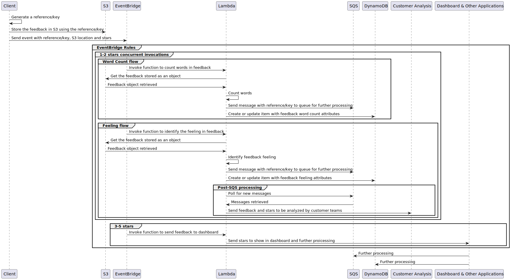

<FigureCaption>Fig 4. Sequence diagram of the solution</FigureCaption>

1. The client initiates the process generating the reference/key that will be used to identify the feedback content in the event store
1. The client stores the feedback content in Amazon S3 using the reference/key generated previously
1. The client sends a message to Amazon EventBridge, the event detail must include stars, bucket and reference/key not to mention we need to set the correct source and detail type to let the rule in Amazon EventBridge process and deliver the event to the correct targets

> __EventBridge Rules__

>> __1-2 stars concurrent invocations__

>>> __Word Count flow__
>>> 1. Amazon EventBridge invokes the Lambda function to count words in feedback
>>> 1. Lambda function gets the feedback content stored as an object in Amazon S3
>>> 1. Amazon S3 serves the object to Lambda function
>>> 1. Lambda function counts the words present in the feedback
>>> 1. Lambda function sends a message to Amazon SQS with the reference/key to a queue (small, medium or large) for further processing
>>> 1. Lambda function creates or updates an item in Amazon DynamoDB with the feedback word count attributes

>>> __Feeling flow__
>>> 1. Amazon EventBridge invokes the Lambda function to detect the feeling in feedback
>>> 1. Lambda function gets the feedback content stored as an object in Amazon S3
>>> 1. Amazon S3 serves the object to Lambda function
>>> 1. Lambda function detects the feeling present in the feedback
>>> 1. Lambda function sends a message to Amazon SQS with the reference/key to a queue (positive, neutral or negative) for further processing
>>> 1. Lambda function creates or updates an item in Amazon DynamoDB with the feedback feeling attributes

>>>> __Post-SQS processing__
>>>> 1. Lambda function pools for new messages in the negative feeling queue
>>>> 1. Amazon SQS delivers the messages to Lambda function
>>>> 1. Lambda function sends feedback and stars to be analyzed by customer teams, like Contact Center, Customer Support or Fidelity and Product teams

>> __3-5 stars__
>> 1. Amazon EventBridge invokes the Lambda function to send the feedback directly to the dashboard
>> 1. Lambda function send the stars to show in dashboard and further processing

1. Dashboard & Other Applications can poll the Amazon SQS queues (count and feeling) to make further processing
1. Dashboard & Other Applications can query the Amazon DynamoDB table to get item attributes to make further processing

### Solution: Store the feedback content and send the message

We initiate the process generating the reference/key we are going to use to store the feedback content in Amazon S3 and, after that, we send the message including this reference to Amazon EventBridge. Below, you can see an example in Python:

```python showLineNumbers
import boto3
import tempfile
import uuid
import json

s3_client = boto3.client('s3')
eb_client = boto3.client('events')

# Bucket to upload the feedback as an object
feedback_bucket = 'eda-claim-check'

# Function to send feedback as an object to S3 and send a reference as an event to EventBridge
def send_feedback(stars, message, bucket):
    if not message or not bucket or not message.split():
        return

    # Generate a unique reference/key
    object_id = uuid.uuid4().hex

    with tempfile.NamedTemporaryFile(delete=False) as temp_file:
        temp_file.write(message.encode('utf-8'))

    s3_client.upload_file(temp_file.name, bucket, object_id)

    event_detail = {
        'stars': stars,
        'bucket': bucket,
        'key': object_id
    }

    response = eb_client.put_events(
        Entries=[
            {
                'Source': 'custom.feedback',
                'DetailType': 'Feedback sent',
                'Detail': json.dumps(event_detail)
            }
        ]
    )

    return response

# Sample positive feedback
feedback_good = '''I found this website to be absolutely amazing! The user experience was excellent from start to finish.
Navigation was a breeze thanks to the intuitive layout and clean design.
I was easily able to find exactly what I was looking for.
The content itself was fantastic - very well written, informative and helpful.
It was also really great how organized everything was into logical categories.
I was impressed by how quickly pages loaded too. Overall, this is an awesome, high quality site that delivers a truly amazing experience. Great work!
'''

# Sample negative feedback
feedback_negative = '''The website is very slow, I think this is a bad aspect because when I am in a hurry it's horrible to wait, not to mention it's boring. I also find difficult to browse through the site, I'd like to have a site map.
'''

# Sample neutral feedback
feedback_neutral = '''The website got the job done and provided the information I was looking for.
The layout and navigation were straightforward enough to find my way around.
Some sections could be organized more logically, but overall it was easy to browse.
The content covered the main topics but wasn't the most engaging to read.
It would be good to see some visuals added for variety.
Performance and load times were adequate.
While there isn't anything particularly impressive about the site, it serves its purpose in a satisfactory manner.
With some tweaks to content and design, the user experience could be improved.
'''

send_feedback(5, feedback_good, feedback_bucket)

send_feedback(1, feedback_negative, feedback_bucket)

send_feedback(3, feedback_neutral, feedback_bucket)
```

In the previous code, you can see how using the AWS SDK and the clients for Amazon S3 and Amazon EventBridge you can store the feedback content using a generated reference/key with [UUID](https://datatracker.ietf.org/doc/html/rfc4122) and send the message later, actually, we are storing and sending 3 feedbacks, 1 positive, 1 negative and 1 neutral.

In the following figure, you can see 3 objects that were created for the 3 stored feedbacks:

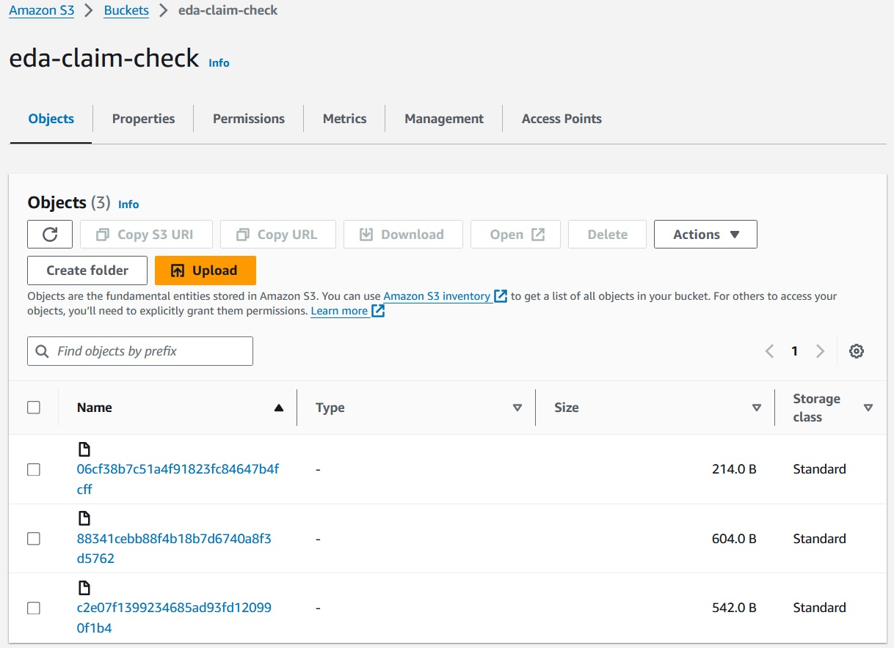

<FigureCaption>Fig 5. Store and send the feedback event</FigureCaption>

Now, the messages for these 3 events were sent to Amazon EventBridge and will be processed accordingly, we will see this in the next section.

### Solution: Routing the message

Amazon EventBridge is an event bus, thus, we can send different events to it and those events will be routed using one or more rules. For our use case, there are 2 rules, first, for those feedbacks with 1 or 2 stars and second, for those feedbacks with 3, 4 or 5 stars:

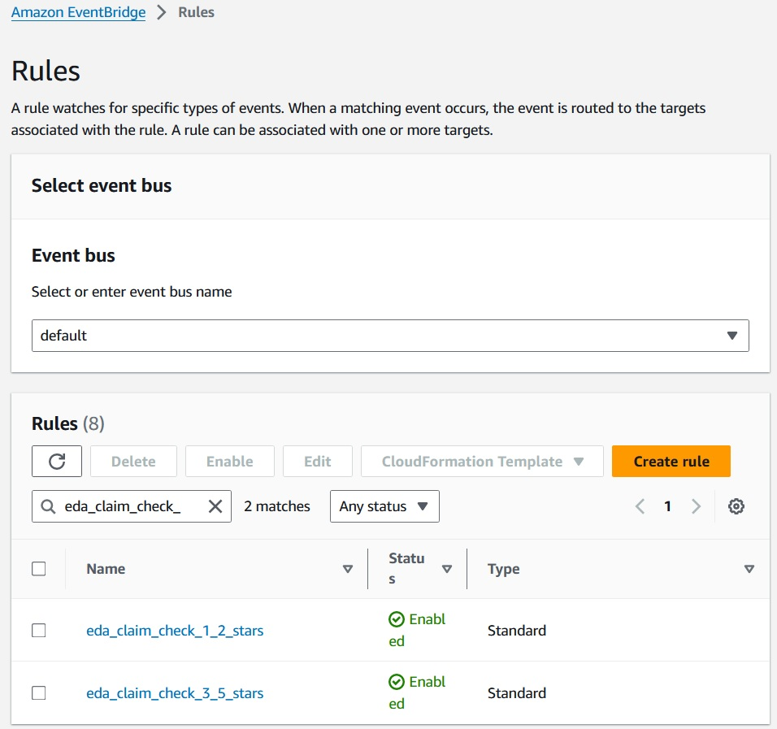

<FigureCaption>Fig 6. Amazon EventBridge rules</FigureCaption>

In our use case, the rules evaluate the __source__ which we decided to be "custom.feedback" and a __detail type__ "Feedback sent". These criteria matches the events from our application, but if we need to separate the workflows based other parameters, we can use the __detail__ field, in our case the __stars__ field, with 1 or 2 stars for this rule:

__Rule: eda_claim_check_1_2_stars__
```javascript showLineNumbers
{
  "source": ["custom.feedback"],
  "detail-type": ["Feedback sent"],
  "detail.stars": [{
    "numeric": ["<", 3]
  }]
}
```

with its targets:

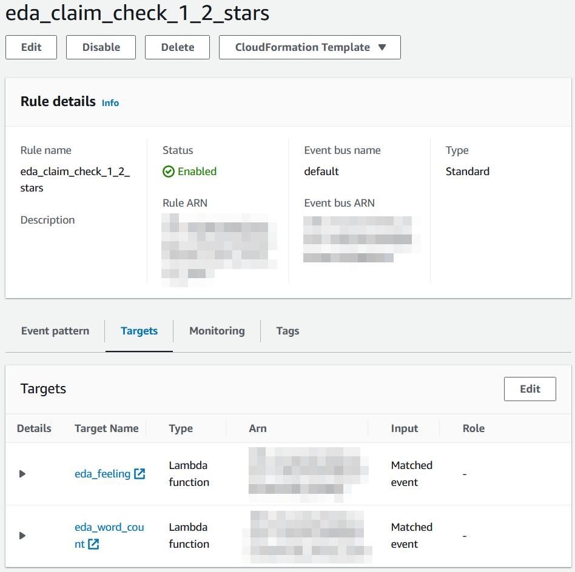

<FigureCaption>Fig 7. Targets for 1-2 stars rule</FigureCaption>

and 3, 4 or 5 stars for this other rule:

__Rule: eda_claim_check_3_5_stars__
```javascript showLineNumbers
{
  "source": ["custom.feedback"],
  "detail-type": ["Feedback sent"],
  "detail.stars": [{
    "numeric": [">", 2]
  }]
}
```

with its target:

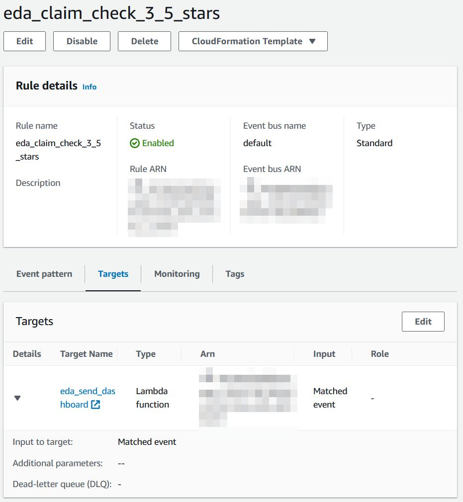

<FigureCaption>Fig 8. Targets for 3-5 stars rule</FigureCaption>

We can customize it even more this rules using the [Amazon EventBridge Event Patterns](https://docs.aws.amazon.com/eventbridge/latest/userguide/eb-event-patterns.html)

As you can see, there are 3 Lambda functions invoked by Amazon EventBridge rules, these functions will be reviewed in the next section.

### Solution: Get the feedback content and process it

Rule __eda_claim_check_1_2_star__ from Amazon EventBridge invokes 2 Lambda functions, __eda_feeling__ and __eda_word_count__. The code for function __eda_word_count__ is the following:

```python showLineNumbers
import boto3
import json
import tempfile

s3_client = boto3.client('s3')
sqs_client = boto3.client('sqs')
dynamodb_client = boto3.client('dynamodb')

# Queues catalog to define boundaries and queues to use
catalog_queues = [
    {'count_words_min': 0, 'count_words_max': 40, 'queue_name': 'eda-length-small'},
    {'count_words_min': 41, 'count_words_max': 99, 'queue_name': 'eda-length-medium'},
    {'count_words_min': 100, 'count_words_max': None, 'queue_name': 'eda-length-large'}
]

# DynamoDB Table to concentrate information about the feedback
DYNAMODB_TABLE = 'eda-feedback'


# Entry point to process the event
def lambda_handler(event, context):
    print('Event:\n', json.dumps(event))

    # Get the reference of the event stored in S3
    bucket = event['detail']['bucket']
    object_key = event['detail']['key']
    stars = event['detail']['stars']

    response = s3_client.get_object(Bucket=bucket, Key=object_key)

    with tempfile.NamedTemporaryFile(delete=False) as temp_file:
        temp_file.write(response['Body'].read())

    print(f'Object {object_key} retrieved from bucket {bucket}')

    with open(temp_file.name, 'r') as f:
        feedback = f.read()
    
    # Count how many words are in the feedback
    feedback_count = len(feedback.split())

    # Identity what queue to send the feedback for further processing
    for queue in catalog_queues:
        if queue['count_words_max'] is not None:
            if feedback_count >= queue['count_words_min'] and feedback_count <= queue['count_words_max']:
                queue_name = queue['queue_name']
                break
        else:
            if feedback_count >= queue['count_words_min']:
                queue_name = queue['queue_name']
                break
    
    print(f'Queue {queue_name} identified')

    message = {
        'bucket': bucket,
        'key': object_key,
        'wordCount': feedback_count,
        'stars': stars
    }
    
    # Send the message for further processing
    sqs_client.send_message(QueueUrl=queue_name, MessageBody=json.dumps(message))

    print(f'Message sent to queue {queue_name}')

    # Create or update the item in DynamoDB, the item can be present in the table and just be updated or it can be created directly
    # We use the reference from S3 to add the information about word count, no matter other processes have taken place
    dynamodb_client.update_item(
        TableName=DYNAMODB_TABLE,
        Key={
            'id': {
                'S': object_key
            }
        },
        ExpressionAttributeNames={
            '#B': 'bucket',
            '#QL': 'queue_length',
            '#WC': 'word_count',
            '#S': 'stars'
        },
        ExpressionAttributeValues={
            ':b': {
                'S': bucket,
            },
            ':ql': {
                'S': queue_name,
            },
            ':wc': {
                'N': str(feedback_count)
            },
            ':s': {
                'N': str(stars)
            }
        },
        UpdateExpression='SET #B = :b, #QL = :ql, #WC = :wc, #S = :s'
    )

    print(f'Item updated in table {DYNAMODB_TABLE}')

    return {
        'bucket': bucket,
        'key': object_key,
        'wordCount' : feedback_count,
        'queueName': queue_name,
        'stars': stars,
        'dynamodbTable': DYNAMODB_TABLE
    }
```

and we can see how it gets the full feedback from Amazon S3 and does the word count and, based on the length, the function sends the feedback metadata to a queue in Amazon SQS and creates or updates an item in a Amazon DynamoDB table. In the following figure you can see the logs for a 1 star negative feeling feedback:

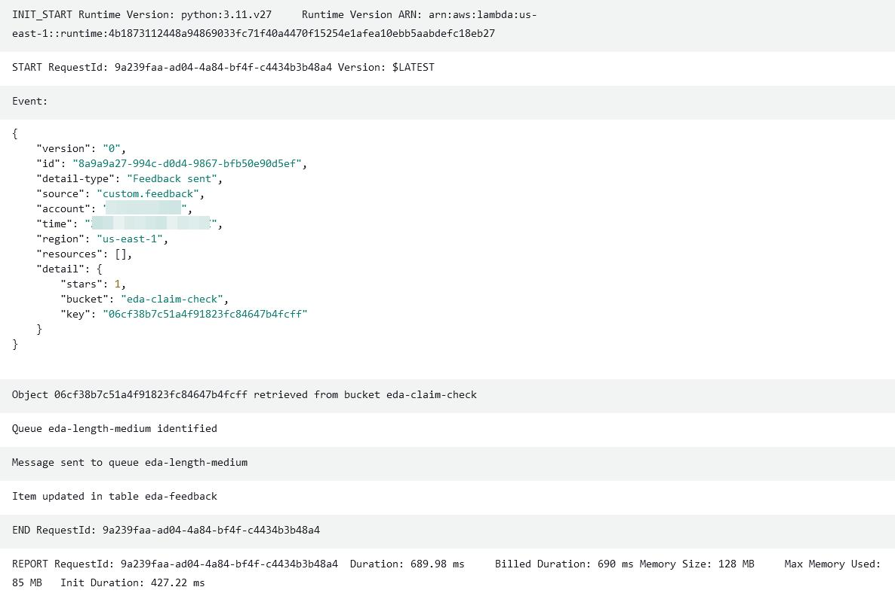

<FigureCaption>Fig 9. Word count Lambda function logs</FigureCaption>

The code for function __eda_feeling__ is the following:

```python showLineNumbers
import boto3
import json
import tempfile

s3_client = boto3.client('s3')
sqs_client = boto3.client('sqs')
dynamodb_client = boto3.client('dynamodb')

# Number of words to consider feedback as positive, negative or neutral
WORDS_THRESHOLD = 3

# DynamoDB Table to concentrate information about the feedback
DYNAMODB_TABLE = 'eda-feedback'

# Queues and their description to use them
queue_positive = {'description': 'positive', 'queue_name':'eda-feeling-good'}
queue_negative = {'description': 'negative', 'queue_name':'eda-feeling-negative'}
queue_neutral = {'description': 'neutral', 'queue_name':'eda-feeling-neutral'}

# Catalog of positive words to identify in feedback
catalog_good_words = [
    'good',
    'great',
    'awesome',
    'amazing',
    'excellent',
    'fantastic',
    'perfect',
    'nice',
    'cool',
    'wonderful'
]

# Catalog of negative words to identify in feedback
catalog_bad_words = [
    'bad',
    'terrible',
    'awful',
    'poor',
    'worst',
    'horrible',
    'boring',
    'lazy',
    'complex',
    'difficult'
]


# Entry point to process the event
def lambda_handler(event, context):
    print('Event:\n', json.dumps(event))

    # Get the reference of the event stored in S3
    bucket = event['detail']['bucket']
    object_key = event['detail']['key']
    stars = event['detail']['stars']

    response = s3_client.get_object(Bucket=bucket, Key=object_key)

    with tempfile.NamedTemporaryFile(delete=False) as temp_file:
        temp_file.write(response['Body'].read())

    print(f'Object {object_key} retrieved from bucket {bucket}')

    with open(temp_file.name, 'r') as f:
        feedback = f.read()

    # Identify how many positive and negativew words are present in the feedback
    count_good_words = count_words(feedback, catalog_good_words)
    count_bad_words = count_words(feedback, catalog_bad_words)

    print(f'{count_good_words} good words and {count_bad_words} bad words')

    # Identity what queue to send the feedback for further processing
    if count_good_words >= WORDS_THRESHOLD or count_bad_words >= WORDS_THRESHOLD:
        if count_good_words > count_bad_words:
            queue_name = queue_positive['queue_name']
            feeling = queue_positive['description']
        elif count_good_words < count_bad_words:
            queue_name = queue_negative['queue_name']
            feeling = queue_negative['description']
        else:
            queue_name = queue_neutral['queue_name']
            feeling = queue_neutral['description']
    else:
        queue_name = queue_neutral['queue_name']
        feeling = queue_neutral['description']
    
    print(f'Queue {queue_name} identified')

    message = {
        'bucket': bucket,
        'key': object_key,
        'feeling': feeling,
        'stars': stars
    }
    
    # Send the message for further processing
    sqs_client.send_message(QueueUrl=queue_name, MessageBody=json.dumps(message))

    print(f'Message sent to queue {queue_name}')

    # Create or update the item in DynamoDB, the item can be present in the table and just be updated or it can be created directly
    # We use the reference from S3 to add the information about the feeling, no matter other processes have taken place
    dynamodb_client.update_item(
        TableName=DYNAMODB_TABLE,
        Key={
            'id': {
                'S': object_key
            }
        },
        ExpressionAttributeNames={
            '#B': 'bucket',
            '#QF': 'queue_feeling',
            '#F': 'feeling',
            '#S': 'stars'
        },
        ExpressionAttributeValues={
            ':b': {
                'S': bucket,
            },
            ':qf': {
                'S': queue_name,
            },
            ':f': {
                'S': str(feeling)
            },
            ':s': {
                'N': str(stars)
            }
        },
        UpdateExpression='SET #B = :b, #QF = :qf, #F = :f, #S = :s'
    )

    print(f'Item updated in table {DYNAMODB_TABLE}')

    return {
        'bucket': bucket,
        'key': object_key,
        'feeling' : feeling,
        'queueName': queue_name,
        'stars': stars,
        'dynamodbTable': DYNAMODB_TABLE
    }
        

# Function to count positive or negative word based on the catalogs
def count_words(text, catalog):
    count = 0
    text = text.replace('\n', '').replace('\r', '').replace('\t', '').replace('.', '').replace(',', '').replace('!', '')

    for word in text.split():
        if word in catalog:
            count += 1
    
    return count
```

and we can see how it gets the full feedback from Amazon S3 and detect the feeling in the text (based on a word catalog, you can try it with other services like [Amazon Comprehend](https://aws.amazon.com/comprehend/) or even GenAI with [Amazon Bedrock](https://aws.amazon.com/bedrock/)) and, based on the feeling, the function sends the feedback metadata to a queue in Amazon SQS and creates or updates an item in a Amazon DynamoDB table. In the following figure you can see the logs for a 1 star negative feeling feedback:

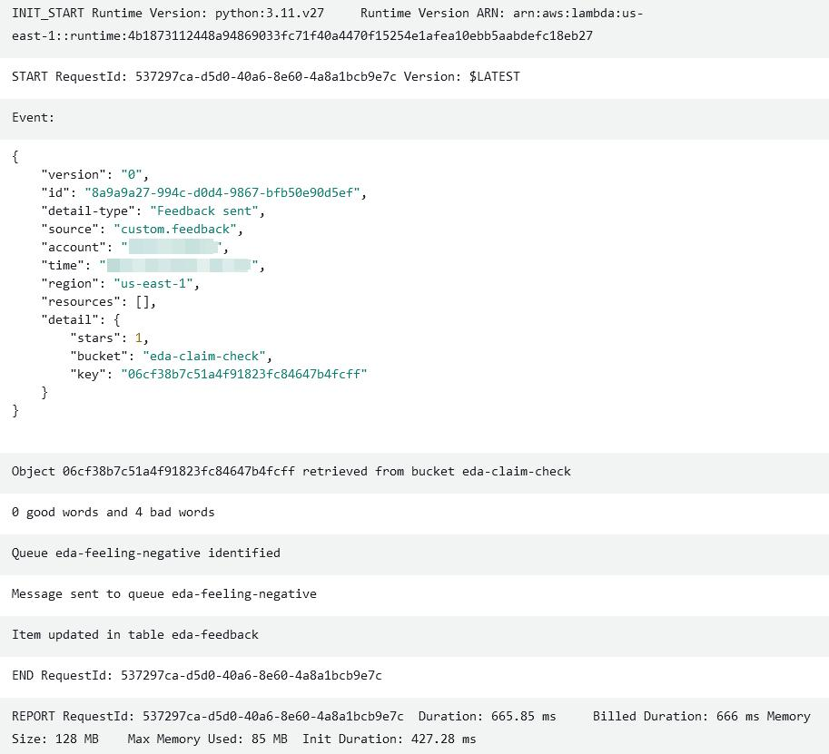

<FigureCaption>Fig 10. Feeling Lambda function logs</FigureCaption>

After the execution of Lambda functions the results are the following, 1 message sent to queue __eda-feeling-negative__ (because of the words present in the feedback), 1 message sent to queue __eda-length-medium__ (because the word count is 44) and an item created/updated in the Amazon DynamoDB table:

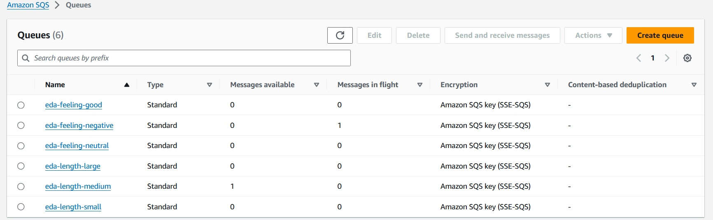

<FigureCaption>Fig 11. Queues after Amazon EventBridge Lambda functions execution</FigureCaption>

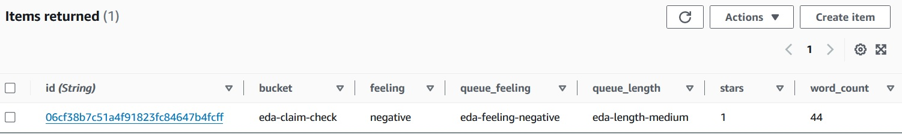

<FigureCaption>Fig 12. Amazon DynamoDB Table after Amazon EventBridge Lambda functions execution</FigureCaption>

Rule __eda_claim_check_3_5_star__ from Amazon EventBridge invokes 1 Lambda function, __eda_send_dashboard__ which code is a dummy like the following (its only purpose is to create a log entry to observe):

```python showLineNumbers
import json

# Entry point to process the event
def lambda_handler(event, context):
    print('Event:\n', json.dumps(event))
    print('Processing event...')
    print('Sending to Dashboard...')
    
    return event
```

In the following figures you can see the logs for a 5 star positive feeling feedback and a 3 star neutral feeling feedback:

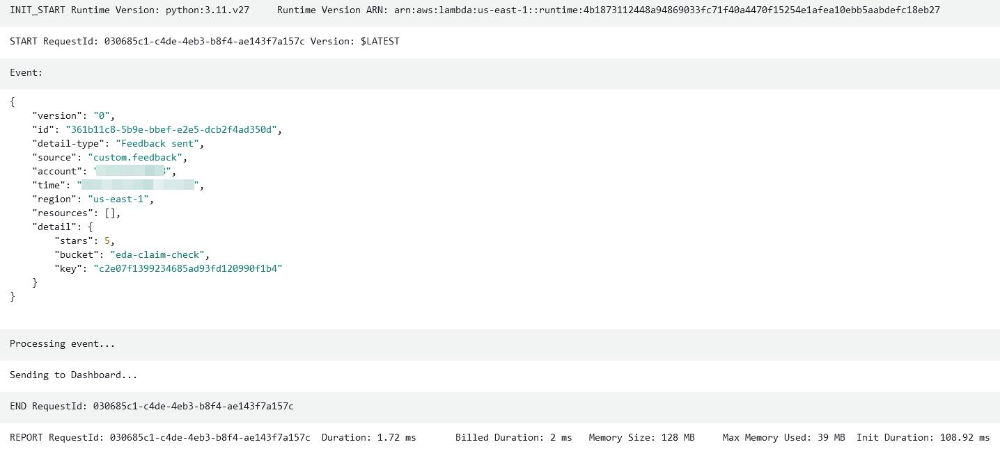

<FigureCaption>Fig 13. Send to dashboard Lambda function logs - 5 star</FigureCaption>

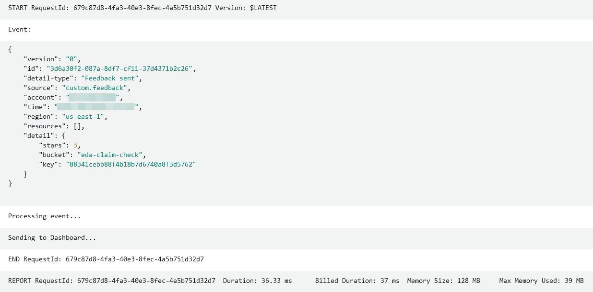

<FigureCaption>Fig 14. Send to dashboard Lambda function logs - 3 star</FigureCaption>

### Solution: Post-SQS processing

As you will see in the architectural diagram, there is a post-SQS processing, this is, in other words, when  AWS Lambda service poll Amazon SQS queue for negative feeling and process the message. The function invoked for this purpose is __eda_send_customer_analysis__ which code is a dummy like the following (its only purpose is to create a log entry to observe):

```python showLineNumbers
import json

# Entry point to process the event
def lambda_handler(event, context):
    print('Event:\n', json.dumps(event))
    print('Processing event...')
    print('Sending to Contact Center...')
    print('Sending to Customer Support...')
    print('Sending to Fidelity and Product teams...')
    
    return event
```

In the following figure you can see the logs for this message processed from Amazon SQS queue:

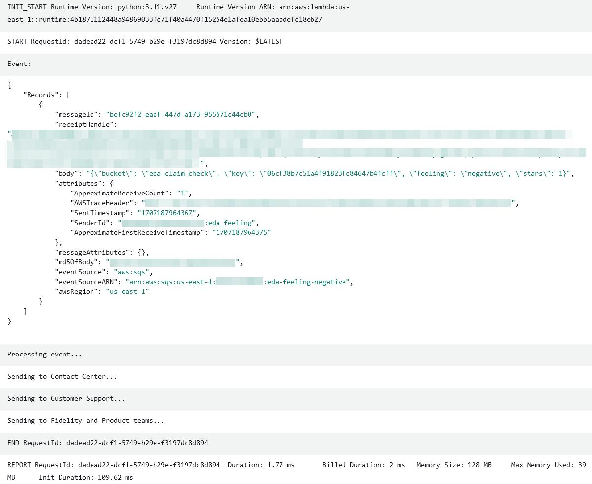

<FigureCaption>Fig 15. Customer analysis Lambda function logs</FigureCaption>

When the Lambda function process the message and exists without error, the message will be deleted from the Amazon SQS queue as you can see in the next figure (there is only the message in the length queue in case any business application need to process it):

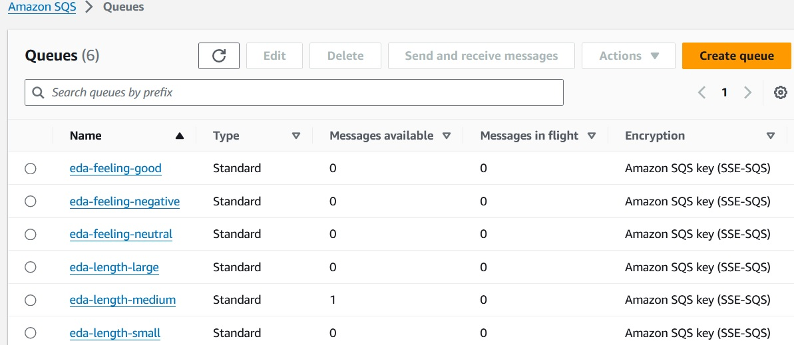

<FigureCaption>Fig 16. Customer analysis Lambda function logs</FigureCaption>

### Solution: Summary

As you can see, applying the Claim Check pattern to enrich messages can be easy if you design it since the beginning, but it doesn't mean you can't add later to your project or architecture, you just have to consider how the systems that depends on this information will be affected and work backwards from that point.

#### Architectural Diagram

You already saw the sequence of interactions, the parts of the system individually and last, but not least, here is the Architectural Diagram:

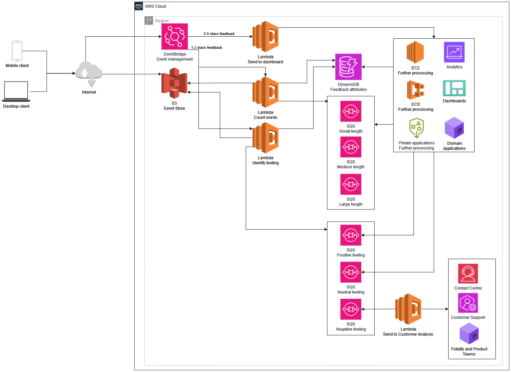

<FigureCaption>Fig 17. Architectural Diagram</FigureCaption>

1. The applications can connect to the front door, in this case, Amazon EventBridge, which can then route the requests to multiple [targets](https://docs.aws.amazon.com/eventbridge/latest/userguide/eb-targets.html)
    - The applications can use private connections, SDK or API calls
1. One of the targets Amazon EventBridge can route our request is, in this case, AWS Lambda, to process the message
1. AWS Lambda gets the feedback content from Amazon S3 and continues processing the word count or the feeling present in feedback
1. After Lambda has done the processing, it sends the word count and feeling detected to a queue in Amazon SQS as well as a No-SQL table in Amazon DynamoDB
1. Business applications like dashboards, other systems or even analytics services can poll messages from Amazon SQS queues or Amazon DynamoDB table to make further processing or analysis
1. In the special case of negative feeling queue, other applications like Contact Center agents, Customer SUpport specialists or other Fidelity and product teams can poll messages from the queue to improve the quality or features of the business

:::note
    AWS Lambda, Amazon DynamoDB, Amazon S3, Amazon SQS, Amazon EventBridge are just options for compute, No-SQL databsae, storage, queue manager and event bus respectively, the architecture can work with any other alternatives
:::


In the Event-Driven Architecture, every action is driven by an event. When the client stores feedback and sends the initial event, the compute layers process and send the requested information. The customer applications can then access the generated information in the queues and NoSQL tables for further processing, regardless of which services or components are used (serverless or serverful). The architecture only works when there are events to process, otherwise, the components remain free.
#### Advantages

- We don't have to wait to have all the information we need to start working
- This pattern enables us to add gradually content to previously sent messages
- We can have a reference/key multiple systems can leverage to interact as soon as they have the data required to continue with its processes without representing a bottleneck to the entire workload
- Some services in AWS present limits and quotas that may not match your applications needs, this is the case for [Amazon EventBridge](https://aws.amazon.com/eventbridge/) when you need to send and entry (event) greater than 256 KB, check [PutEvents API](https://docs.aws.amazon.com/eventbridge/latest/APIReference/API_PutEvents.html#API_PutEvents_Examples) and [Calculating Amazon EventBridge PutEvents event entry size](https://docs.aws.amazon.com/eventbridge/latest/userguide/eb-putevent-size.html) for more information. In this solution you can see how to overcome this situation
- Consume the same event or message from multiple applications can be challenging when you don't have an event bus, but with [Amazon EventBridge](https://aws.amazon.com/eventbridge/) you can set multiple targets to deliver an event when this event matches with one or more rules in the bus. You can also use [Amazon SNS](https://aws.amazon.com/sns/) in some scenarios, for more information about deciding wich service to use, please check [Choosing between messaging services for serverless applications](https://aws.amazon.com/blogs/compute/choosing-between-messaging-services-for-serverless-applications/)

#### Disadvantages

- As this pattern enables you to start sending messages early, this same feature implies that you have to be aware of those systems that depends on the sent information or the lack of it
- You need to identify very clearly all the inter-dependencies between your different systems or components
- The capacity to let the information to enrich our messages later doesn't mean that we have a license to let the system in an unstable status, so we need to have special care on this

## Resources

If you want to go deeper in this topic, you can review the following resources:

### Course: Skill Builder "Designing Event-Driven Architectures"

[AWS Skill Builder](https://skillbuilder.aws/) is a great place to learn for free about multiple topics, including [Designing Event-Driven Architectures](https://explore.skillbuilder.aws/learn/course/internal/view/elearning/12715/designing-event-driven-architectures)

### Web: Serverlessland Claim check

Serverless services on AWS and Event-Driven Architectures (EDA) are very good friends so you should check [Serverless Land](https://serverlessland.com/) where you can find a lot of great curated content about Serverless, but also these technologies applied to EDA in [Claim check pattern visuals](https://serverlessland.com/event-driven-architecture/visuals/claim-check-pattern) and some other implementations with [Amazon S3 and Amazon EventBridge](https://serverlessland.com/patterns/s3-to-eventbridge-claim-check-pattern)

### Book: Enterprise Integration Patterns

A book will always be our ally during our learning, you can check [Enterprise Integration Patterns](https://www.enterpriseintegrationpatterns.com/) and check this specific [chapter](https://www.enterpriseintegrationpatterns.com/patterns/messaging/StoreInLibrary.html)
