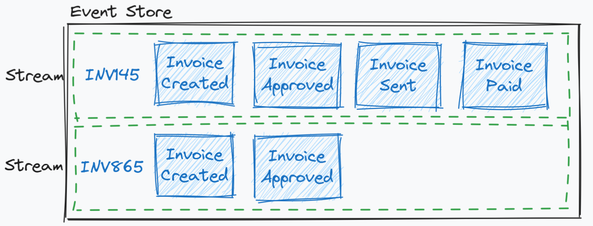
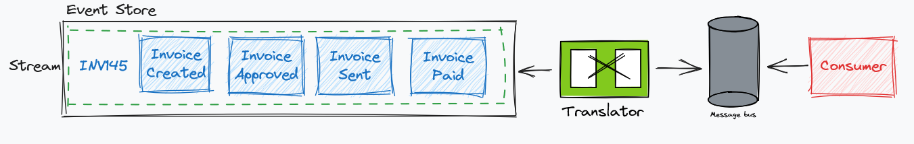
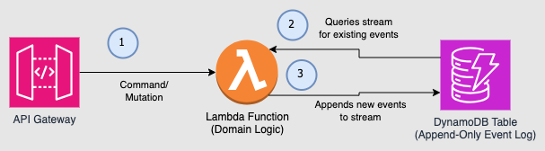
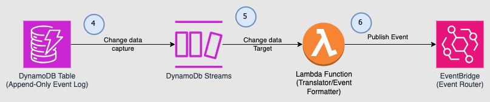
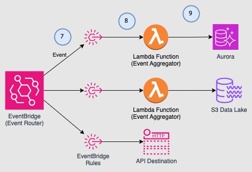

import { EventSourcingProfileCard } from "@site/src/components/ProfileCard";
import { FigureCaption } from "@site/src/components/FigureCaption";

# Event Sourcing: domain events as the source of truth

:::info

This article explains what event sourcing is, common use cases, considerations and examples.

:::

<EventSourcingProfileCard />

# Event Sourcing

This document discusses an approach to building event sourced systems. The use cases, architecture
patterns and implementation details using both AWS native services and open source options.

Event Sourcing is an architecture pattern that stores an application’s state as an append-only log
of events. As well as storing the events, you also have the context surrounding that event. You can
see the set of actions that happened that caused your application to get to it’s current state. This
differs from the traditional approach of building applications in which only the current application
state is stored. With a traditional data storage mechanism it is almost impossible to understand how
a record got to the state it is currently in.

If you consider your bank account for a moment. Seeing the debits and credits against your account
is a close example to how an event sourced system works. You can see the debits and credits that
happened, and how your current account balance got it’s current amount. In a traditional table based
approach, you would only store the current account balance and no information about how your account
got to that amount. The current balance is stored and mutated, but you would never know how the
account got into that state.

## Why Use Event Sourcing?

Event Sourcing is a viable solution for a wide range of industries and application use cases.
Instead of discussing specific domains where event sourcing is relevant, let’s focus on some of the
benefits of using event sourcing. Because an event sourced system is based on an append-only log,
one of the key benefits is auditability. If the ability to view the state of your system at a
specific point in time is useful then event sourcing is a great choice. You can easily perform root
cause analysis as you can see exactly how the current state of the system was reached. Imagine
checking your bank balance and you had $2,000 less than expected but no way to work out why.

The immutable log of events is highly beneficial for event replay. If new services are introduced or
existing services go offline temporarily, the log of all past events allows these services to replay
the events and bring their state up-to-date. The log serves as a reliable source of truth, enabling
services to catch up with the current system state by replaying the relevant events. The technical
considerations and implementation details of event replay are covered later in this document.

Sharing data between services in the form of events also allows downstream consumers to more easily
react to changes elsewhere in the system in real time. LinkedIn discuss this approach at length in a
post
[on their engineering blog](https://engineering.linkedin.com/distributed-systems/log-what-every-software-engineer-should-know-about-real-time-datas-unifying).
They use an append-only log as a way to share data between different services and allow near real
time analytics to be performed. There is a key distinction here between event sourcing and event
streaming, which is covered later in this document.

## Event Sourcing Key Concepts

Every change that happens in your application is represented as an event and appended to the event
store. The event store is simply a persistent database layer, of which the technology choice is
discussed later in this document. All events stored in the event store are immutable, and the event
data typically also includes additional metadata like timestamps, unique ID’s and correlation
information. All business changes are applied as an event which is appended to the end of the log.
This provides full visibility into the lifecycle of a domain object in your application, for example
an invoice.

Inside the event store, events are stored in a stream. This is not to be confused with event
streaming, which will be discussed later in this document. An event stream inside the event store
refers to all of the events related to a specific domain object. Event streams are the source of
truth for the domain object and contain the full history of the changes. Each stream will have an
identifier specific to the domain, in this case the Invoice Number is used as the stream identifier.
Events are stored ordered inside the stream. Typically each event is added with a numeric
incremental position number that defines the order of the event in the stream.



<FigureCaption>Fig 1. Events in an event stream</FigureCaption>

When the application state needs to be re-created, events from the relevant stream are read and
applied to the domain object in order. With large numbers of events, this read and apply process
will start to have an ever increasing performance impact. Event Streams can store large number of
events, and you can have large numbers of streams. You should have lots of short-lived streams with
fewer events, instead of long-lived streams with lots of events. Shorter streams help with
maintenance, versioning and reduces the need for snap-shotting which will be discussed later in this
document.



<FigureCaption>Fig 2. Change data capture with Event Sourcing</FigureCaption>

A common implementation detail when deciding on an event store technology is the ability to use
change data capture (CDC) or use a database engine that can stream database changes (e.g. DynamoDB
streams). This allows events to be published for downstream consumers to subscribe to. External
consumers should never subscribe directly to the events data coming out of the event store. Rather,
a message translator should be in place to ensure any events published outside of the domain are
translated to a public event, ensuring domain implementation details are not leaked to external
services. This aids with evolvability and versioning, as you can make changes to your domains events
without worrying about downstream consumers.Message translator has full control on which domain
event to be published to external consumers. Using event sourcing system, You can control storing
domain events and publishing external integration events for downstream changes.

### Projections / Aggregates

How does the current state get calculated if you store everything as a stream of events over time?
Projections or aggregate views are created from the events. Think of projections like a database
view. It's a specific representation of the events to answer business questions or populate a model
in the UI. For instance, a user wants to know how their account arrived at its current state;
however, they also need to know the current balance and how much can be withdrawn. These are not
inherent to the events, but projections of the facts that have occurred.

Projections allow queries to run against pre-optimized views built specifically for the required
access pattern. It’s important to note that the event store is single source of truth. Any
projections could be destroyed at any time and recreated by replaying events stored in the event
store. This opens up interesting possibilities for the technology used to store your projections, as
this could be a cache or even in-memory. A single system might have several different projections to
meet the different required access patterns.

## Event Sourcing vs Event Streaming

A common confusion is to mistake event sourcing for event streaming. This becomes more confusing
when the term ‘stream’ is used within event sourcing to describe the events related to a specific
domain object called an aggregate root. Event sourcing is an append-only log of business events;
event streaming is an integration technology for sharing events. For example, in the message
translator example above the message bus could be replaced with a streaming technology (Kafka,
Kinesis). Downstream consumers could then subscribe to that stream of events in the same way they
would subscribe to events on an event/message bus.

An event store exists inside the boundaries of a given microservice or domain. And when data is
shared outside of that microservice it would be translated into a public event or external
integration event . Utilizing a streaming technology as your event store, opens up the possibility
for downstream consumers to subscribe directly to your event store instead of first passing through
a translation layer. The EventStoreDB website covers this topic, stating that
[“EventStoreDB is about storing and streaming data, Kafka is about data in motion”.](https://www.eventstore.com/blog/eventstoredb-kafka)
Kafka (or Kinesis) is a good fit for **streaming** events to downstream systems, and provides an
element of durability that would allow a consumer to replay all events from a given point in time.
However, an individual microservice using a shared Kafka/Kinesis resource is an example of a leaky
abstraction and should be avoided.

For the remainder of this document, Kafka/Kinesis will be referred to as streaming technologies
whilst the stream of events related to a given domain object will be referred to as the event
stream.

## Taking Snapshots

Whenever a mutation is applied to a given domain object, all of the events in the object’s event
stream are read from the event store and applied to the object object in memory. The new change is
then applied based on the mutation command which will append additional event(s) to the event stream
for that aggregrate root. A potential challenge may occur when the volume of events in a single
event stream becomes excessively high, causing a detrimental effect on the overall performance of
your application from the number of read operations that must occur to load the current state of the
object.

A common solution to this problem is to take snapshots. Snapshotting is the process of periodically
taking and storing the current state of your application in the database. When current state needs
to be reconstructed, the snapshot is read and only the delta of events since the snapshot was taken
need to be applied.

The challenge arises when trying to establish how often to take the snapshot. Every day, week or
month? Every 10 events? Every 20 events? And it’s difficult to predict now, how the needs of your
application will change tomorrow.

The alternative approach, is to either have long lived streams with very few events or to simply
break your streams down into the shortest possible number of events. An example provided by Oskar
Dudzyk in this domain is for the cashiers in a retail store. You could have:

- One single event streams for all events related to a given store
- An event stream for each day of trading
- An event stream for each active cash register/till
- An event stream for each individual cashier’s shift, working on each individual cash register/till

The last example has a very clear beginning and end and is the shortest possible stream you could
implement for this domain. The CashierShiftEnded event could include the closing balance of the
register/till, which would then form the first event in the next cashier’s shift. This process is
referred to as book-ending.

## Event Replay and Hydrating New Services

In an event-sourced system, the ability to replay events is crucial for data recovery and
reconstruction, as replaying events allows you to reconstruct the entire system state at any given
point, enabling data recovery in case of failures or corruption. It also provides a complete history
of changes, facilitating auditing and analysis of user activities. By reproducing event sequences,
you can simulate scenarios and identify issues more easily for testing and debugging purposes.

Replaying events helps rebuild data in new formats or system versions, ensuring consistency during
migrations or upgrades. Additionally, events can be replayed to create different data views or
projections tailored to specific use cases, enabling parallel processing and projections.
Furthermore, it enables time-travel and analysis of the system's state at any given point in
history, allowing for historical data analysis.

Effective event replay mechanisms are necessary to manage performance overhead, especially in
large-scale systems with high event volumes.

## AWS Native Implementation Example

Event sourcing can be implemented on AWS using services such as RDS, databases on EC2 or DynamoDB.
In the example below we show one possible method using Amazon DynamoDB.

### Event Sourcing

To implement event sourcing on Amazon Dynamo DB, first consider what event sourcing is at its core:
an ordered, append-only log of events per entity stored as a stream. This can be implemented simply
with a single table using the `streamId` as the table’s partition key and the `eventNumber` as the
sort key. Add in several important additional properties when saving the event data like the event
type, date the event occurred and the unique data for the event.

- `streamId` - unique identifier for the entity.
- `eventNumber` - specifies the numerical order of the event in the entity’s stream
- `eventType` - indicates the name and version of the event
- `updated` - the date/time the event was created
- `data` - varies based on the event being stored

Using the invoice example from above, the events for a single invoice could be represented in JSON
and stored in the Dynamo DB table as follows:

```javascript
{
  "streamId": "inv145",
  "eventNumber": 0,
  "eventType": "invoice-created.v1",
  "updated": "2024-03-13T12:13:42.492473Z",
  "data": {
    "customer": "cus123",
    "total": 123.45
  }
},
{
  "streamId": "inv145",
  "eventNumber": 1,
  "eventType": "invoice-approved.v1",
  "updated": "2024-03-14T12:13:42.492473Z",
  "data": {
    "approved-by": "emp123"
  }
},
{
  "streamId": "inv145",
  "eventNumber": 2,
  "eventType": "invoice-sent.v1",
  "updated": "2024-03-14T12:16:37.492473Z",
  "data": {}
},
{
  "streamId": "inv145",
  "eventNumber": 3,
  "eventType": "invoice-paid.v1",
  "updated": "2024-04-14T08:32:26.00000Z",
  "data": {
    "payment-amount": 123.45
  }
}
```

Events for additional invoices or other types of entities can be stored in the same table.

An initial AWS architecture for event sourcing starts with this.



<FigureCaption>Fig 3. Writing events to DynamoDB</FigureCaption>

1. Commands such as `Approve Invoice` are sent through the API Gateway to a Lambda function.
2. The Lambda function containing domain logic queries the DynamoDB table for the entire event
   stream for the invoice specified. These events are used to rebuild the Invoice object in memory.
3. The Lambda function processes the Approve Invoice command by validating the state and then
   applying the Invoice Approved event. When the Invoice object is saved, the new event is added to
   the DynamoDB table.

### Publishing Events

Publishing domain events is a vital component of event sourcing-based systems. There are two primary
purposes of those events:

1. Create projections or views of the data as needed by the user interface(s) of the application.
2. Notifying third parties outside of the system of changes that have occurred within the system.



<FigureCaption>Fig 4. Publishing events with DynamoDB streams</FigureCaption>

Event publication can be accomplished using DynamoDB streams which is is an ordered flow of
information about changes to items in a DynamoDB table.

4. As new events are inserted into the DynamoDB table, those changes are pushed to the DynamoDB
   stream.
5. Amazon DynamoDB is integrated with AWS Lambda so that you can create _triggers_—pieces of code
   that automatically respond to events in DynamoDB Streams.
6. The Lambda function then formats the event and publishes to EventBridge, which is a serverless
   event bus that ingests data from your own apps, SaaS apps, and AWS services and routes that data
   to targets.

### Responding to Events

EventBridge events are only useful if someone or something is listening to them. A _target_ is a
resource or endpoint that EventBridge sends an
[event](https://docs.aws.amazon.com/eventbridge/latest/userguide/eb-events.html) to when the event
matches the event pattern defined for a
[rule](https://docs.aws.amazon.com/eventbridge/latest/userguide/eb-rules.html). The rule processes
the [event](https://docs.aws.amazon.com/eventbridge/latest/userguide/eb-events.html) data and sends
the pertinent information to the target.



<FigureCaption>Fig 5. Subscribing to events with EventBridge</FigureCaption>

7. EventBridge rules match the event to the rule pattern
8. Matching events are sent to the targets.
9. The target processes the event and performs necessary actions such as creating a view of the data
   in a relational database, archiving a copy of the event in a data lake, or sending the event to
   an external API destination over HTTP.

## Conclusion

Event sourcing is a good fit for complex business domains that require a historical log of events.
The benefits of this pattern need to be weighed against the complexity of constructing projections
or aggregates across many events and synchronization across domains.
