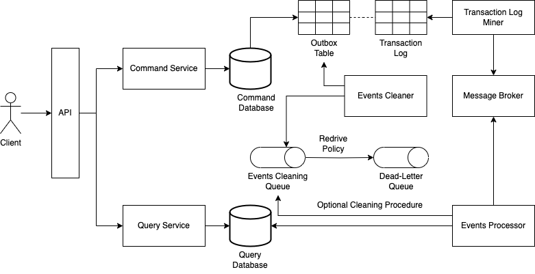
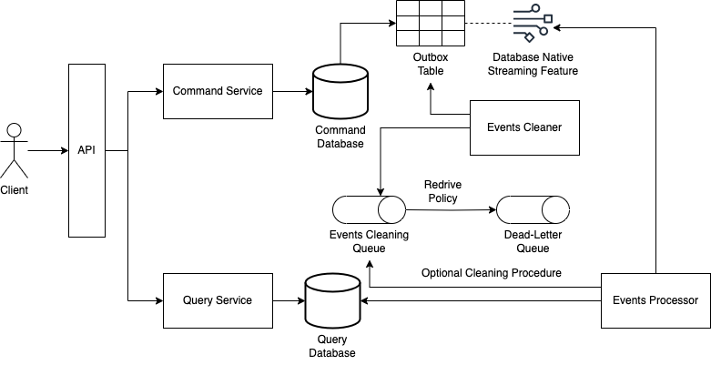

import {CQRSProfileCard} from "@site/src/components/ProfileCard";
import {FigureCaption} from "@site/src/components/FigureCaption";

# The Command Query Responsibility Segregation Pattern

:::info

This document explains what the CQRS pattern is, along with implementation strategies, each with a list of benefits and limitations.

:::

<CQRSProfileCard/>

# The Command Query Responsibility Segregation Pattern

Most of the time, when developing software, we'll make use of a database to store our data. There are a few exceptions, though. For example, when our software simply generates something for download, but most of the time we will have to store some data. The software will accept user's inputs, maybe perform some computation, and store the results. As much as we provide ways in our software to store data, we need to provide ways to retrieve it, as records to be updated or deleted, or in lists that come through the searching of users.

Sometimes, one database will make it in our software. In these cases, our software will perform well when we store data and retrieve it. However, there are cases in which we need different computational needs for these two concerns. It may be, for example, that we have many more reads than writes in our application. Or, the domain model from the real world we are representing in the data model of our database does not favor reads. Although it is performing well with writes, it can be hard to retrieve data.

For these situations, the CQRS architectural pattern proposes separating these concerns. It proposes having one service for writing data, and another one for retrieving data. And, if we have two services for each purpose, it will make sense to have different databases or data models.

## Introduction

In 1988, [Bertrand Meyer](https://bertrandmeyer.com) introduced the idea of [Command Query Separation](https://martinfowler.com/bliki/CommandQuerySeparation.html), or CQS, in his book [Object-Oriented Software Construction](https://dl.acm.org/doi/book/10.5555/534929). The idea is that the methods of an object should belong in one and only one of two categories: methods that only return value and do not mutate state, and methods that only mutate state and do not return any value. Then, inspired by this idea, Greg Young first introduced the idea of the Command Query Responsibility Segregation, or CQRS, pattern in a talk gave by him at QCon San Francisco, in 2006. It was only after [a second talk presented by him, at QCon San Francisco, on November 8, 2007](https://qconsf.com/sf2007/sf2007/presentation/Scaling%2bDomain%2bDriven%2bDesign.html), that the idea began to become a pattern in the software industry. The idea is that our software can be structured so that there are two services, one responsible for write/command operations and the other for reading/query operations, each service with its own database.

And why would we do this? Why not just having a single database in our solution? The CQRS pattern is useful when there are different computational needs for reads and writes. This can happen when we have more reads than writes in our software. And thinking in the case in which we have only one service to serve reads and writes, even though we can prepare our architecture to scale properly, one concern may eventually get in the way of the other, and writes may start affecting reads and vice-versa.

The CQRS architectural pattern proposes having two different services, each one dealing separately with reads and writes, but not necessarily we need different data models. As an example, considering a relational database, we can have one service dealing with the database's writer instance, and another service dealing with the reader instances. This is one of the forms of CQRS.

Performance issues can also happen in cases when the data model of our solution does not favor data retrieval, or because the performance of data retrieval operations are under our expectations.

Imagine the following scenario: we have an application that receives events that are happening with aircraft all over the world, including data that represent take offs, landings and location. Data is stored in a relational database.

<FigureCaption>Fig 1. A hypothetical domain model, representing aircraft and their corresponding events.</FigureCaption>

Let's say that we would like to generate a view with consolidated data of a list of aircraft.

<FigureCaption>Fig 2. A view containing consolidated data of a list of aircraft.</FigureCaption>

For each aircraft of the list, we could perform several queries and assemble each widget. But because we have a list of events, we would need to issue select commands that would likely take several seconds each. What if the list contains tens of aircraft? That would result in a poor user experience. What if there are thousands of people viewing different lists of aircraft? Our application would demand computing resources unnecessarily, and thus would be unnecessarily more expansive.

Our dilemma in these cases is that, even though our data model in the database and our domain model in our code appropriately reflect a real world abstraction, retrieving data is a challenge. In the example addressed above, what we could do is have a data model in the database we are already using, and have a service deal with it, and another data model in which we could have these information in a precomputed fashion, in another database and other data model, one that would be more appropriate for data retrieval, that would be queried by another service.

Having a service to deal only with operations that mutate state in a database, and a service to deal only with operations that retrieve data from another database is exactly what the CQRS architectural pattern proposes.

## The Pattern

The CQRS architectural pattern is relatively simple: we have a service that receives commands and a service that receives queries, each service dealing with either different databases or different instances (writer and reader instances) of the same database in the same cluster.

<FigureCaption>Fig 3. The CQRS architectural pattern.</FigureCaption>

Here, command and query have the same meaning as Bertrand Meyer proposed in the CQS principle: commands will mutate state in the writer instance/database, and these changes will somehow be replicated to the reader instance/database, which is served by the query service.

It solves two problems. First, we can have different services to deal with command and query-related instructions separately, each having the most appropriate computing resources and technological stack. Second, we can have different data models in each service, each data model favoring each concern.

The challenge of this pattern is: how can we transport data from the command side to the query side in a reliable way? Meaning, how can we guarantee that one change in the command service will be guaranteed to be propagated to the query service?

There are some strategies.

## Implementation Strategies

To implement CQRS, there are some strategies and services we can make use of, depending on the needs, constraints and resources that are available to us. Let us explore.

### The Database's Writer Instance Replicates Data Natively and Asynchronously to the Reader Instance

The most straightforward implementation strategy is having the database asynchronously replicate data to the query database. This is possible when the database being used has a native way of replicating data to one or more reader instances in the same cluster.

<FigureCaption>Fig 4. CQRS with the database's native asynchronous data replication.</FigureCaption>

In this case, the database has to natively provide a way to replicate data between instances. One writer endpoint will abstract the writer instance, whereas a reader endpoint will abstract one or more reader instances.

#### Benefits of This Approach

* Simple approach, as data replication is dealt natively by the database.
* We can leverage as many reader instances as we need in the database, up to the database's limit.

#### Limitations of This Approach

* The limit of reader instances will be what the database offers.
* We will be limited by one data model: the same data model will serve both command and query services.
* It offers a way to update only one target, because we are using a single database.
* Events cannot be replayed.
* The database has to natively offer the idea of writer and reader endpoints, and has to natively implement the idea of asynchronous replication of data from the writer instance to the reader instances.

### The Command Service Publishing Events to a Queue

Another simple approach is to publish an event to a queue in the command service, which will be read by a component in the query service that will update the database of the query service.

<FigureCaption>Fig 5. CQRS with events being published from the command service, to be read in the query service.</FigureCaption>

In this approach, it is important to consider the cases in which the Events Processor, which is the component that reads the events queue and updates the query database, will not be able to update the query database for some reason. In these cases, the event issued by the command service will have to be redriven a dead-letter queue, from which it will have to be processed somehow by other components.

It is also important to mention that the Events Processor component will need to have retries mechanisms with the idea of an exponential backoff. For example, suppose that the query database is down when the Events Processor tries to update it. If it keeps trying to update it immediately, it will likely fail and it will be redriven to the dead-letter queue. Instead, it has to try to update the query database in increasing intervals, so it can give some time for the query database to recover.

#### Benefits of This Approach

* Simple strategy, as publishing events to a queue is a pretty straightforward approach.
* Possibility of having different data models. For example, the command service can deal with a relational database, whereas the query service can deal with a document/aggregate-oriented database.

#### Limitations of This Approach

* We need to have idempotency in mind, in the Events Processor component, as the queue may publish the event more than once.
* The queue being used has to provide the mechanism of redriving messages to a dead-letter queue.
* In the event of the event being redriven to the dead-letter queue, we will have to process the event with other components, in other ways (e.g., sending an email to let someone know that it was not possible to process a given event).
* Events in a queue can only be processed by one component.
* if the Events Processor component is to update targets other than the query database, it will have more responsibilities and it will also have to deal with all the complexity of reprocessing events in the event that some of the targets could be updated and others could not.
* Events cannot be replayed.

### The Command Service Publishing Events to an Event Bus

Another possibility is to have the command service publish events to an event broker, which will have two rules, being one to send the event to a component that will update the command database, and another component that will update the query database.

<FigureCaption>Fig 6. CQRS with events being published to an event broker, that will publish it to components that will update the command and query databases.</FigureCaption>

An important observation here is that the event that is published by the event bus to the processors will have to be as complete as possible, so the databases can be updated accordingly. Or the command service can save the payload of the event in a storage service, so it can be retrieved by the processors so they can update the databases properly.

#### Benefits of This Approach

* As we have an event bus, we can add other rules and update other targets, up to the limits of the event bus.
* The event bus can deal with retries, when delivering the event to the processors.
* Events can be replayed if the event bus offers this feature, no matter if the database being used in the command service is relational or NoSQL.
* Possibility of having different data models. For example, the command service can deal with a relational database, whereas the query service can deal with a document/aggregate-oriented database.

#### Limitations of This Approach

* We need to have idempotency in mind, in the Events Processor components.
* We will be limited to the targets offered by the rules. In the event that we need to send our event to a target not supported by the event bus, there is always the possibility of sending the event to custom code (e.g., an object/method or function), which will in turn send to the desired target, but there is extra code we'll have to create and maintain.
* We will be limited by the limits of the event bus.
* The event to be posted in the event bus must be full state, otherwise it is necessary to provide a way to retrieve extra data from the command database.
* If the event bus does not offer the possibility of replaying events, this will not be a possibility.

### The Command Service Persisting Events to an Outbox Table, With Polling Publisher

A pattern that we can combine with CQRS to publish events is the Transactional Outbox pattern. Because we need to publish events from the command service to the query service, it makes sense to make use of it in a CQRS context. In this approach what we are going to do is, rather than publishing an event to an event bus, we will commit, in the same transaction, along with the data that we would normally persist, a record in the outbox table that represents the event that will be published and consumed by the query service.

<FigureCaption>Fig 7. CQRS with the Transactional Outbox and Polling Publisher patterns.</FigureCaption>

And because we're persisting a record that represents the event we are going to publish along with data we would normally persist in the same transaction, we need a mechanism to retrieve this record and publish it. In this approach, the Outbox Table Poller component will be run at a fixed rate (e.g., every 1 minute), retrieve the records of the events that were not yet published, and send them to a structure (e.g., a queue), from which they will be further processed and the query database will finally be updated.

The observation is that we'll need to implement a mechanism to clean the outbox table, so it does not grow inadvertently. Or, if the database offers a mechanism to purge data, we'll favor and leverage it, and let this concern to the database. This is so when we don't need to replay events. If we need, then we cannot delete events immediately after they were consumed, and think of other ways of deleting them.

#### Benefits of This Approach

* Relatively simple approach.
* The events will be guaranteed to be published, as they are persisted along with transactional data in the same transaction.
* This approach works in any context in which events have to be published.
* Events can be replayed by retrieving them from the outbox table more than once.
* Possibility of having different data models. For example, the command service can deal with a relational database, whereas the query service can deal with a document/aggregate-oriented database.

#### Limitations of This Approach

* When retrieving events from the outbox table, it will not be possible to get transaction-related data, as we're retrieving records directly from the outbox table, and not from its transaction log.
* We need to have idempotency in mind, in the Events Processor component.
* We need to be careful not to publish the same event twice from the outbox table. Even though we must have idempotency in mind, we want to save processing as much as possible and avoid processing the same event more than once unnecessarily.
* The amount of time the databases will be out of sync is higher (to the order of seconds to minutes).
* If the database does not offer a way to natively clean the outbox table, we will need to implement the cleaning procedure ourselves, so the outbox table does not grow in size inadvertently.

### The Command Service Persisting Events to an Outbox Table, With Transaction Log Tailing

Still making use of an outbox table, another possibility is to have a Transaction Log Miner component retrieve data from the outbox table's transaction log and have it publish data to a message broker (normally, a stream of events).

<FigureCaption>Fig 8. CQRS with the Transactional Outbox and Transaction Log Tailing patterns.</FigureCaption>

Just like with the Polling Publisher technique, we'll also need a mechanism to clean the outbox table, be it our own implementation or a mechanism provided by the database (which is preferred).

One observation here is that, because we're retrieving data from the outbox table's transaction log, if we're implementing our own cleaning mechanism, we'll need to filter out some of the events and publish only what represents insertions, as deletions will also be captured by the transaction log miner component.

#### Benefits of This Approach

* The events will be guaranteed to be published, as they are persisted along with transactional data in the same transaction.
* This approach works in any context in which events have to be published.
* We have access to transaction-related data, as it is the outbox table's transaction log that is being read, rather than the outbox table itself.
* If the message broker to which events are being published offers the possibility of reading the same event more than once (e.g., it is a stream), then events can be replayed. Or, if it doesn't, we will need to create a mechanism to read the outbox table itself, but then we won't have access to transaction-related data.
* Possibility of having different data models. For example, the command service can deal with a relational database, whereas the query service can deal with a document/aggregate-oriented database.

#### Limitations of This Approach

* There are many transaction log miner components in the industry, and each has their pros and cons. We'll be limited by the databases supported by the transaction log miner of our choice, as well as the message brokers they can publish messages to.
* We need to have idempotency in mind, in the Events Processor component.
* If the database does not offer a way to natively clean the outbox table, we will need to implement the cleaning procedure ourselves, so the outbox table does not grow in size inadvertently.

### The Command Service Publishing Events via Native Database Streaming Feature

If the database being used in the command service has a native streaming feature, a possibility is to have it stream changes in the outbox table to be captured by the component that processes events and updates the database of the query service.

<FigureCaption>Fig 9. CQRS with the Transactional Outbox pattern and the database's native streaming
    feature.</FigureCaption>

And just like the other approaches that also make use of an outbox table, we need to have a mechanism to clean the outbox table. We also have to filter out events in the events processor component that do not represent insertions that were made.

#### Benefits of This Approach

* A simpler approach, as we're leveraging the database's native streaming feature.
* If the streaming feature offers a way to retrieve the same event more than once, then replaying events will be a possibility.
* Possibility of having different data models. For example, the command service can deal with a relational database, whereas the query service can deal with a document/aggregate-oriented database.

#### Limitations of This Approach

* We'll only have access to the data that is published by the database's streaming feature.
* We need to have idempotency in mind, in the Events Processor component.
* If the database being used does not natively provide a mechanism to purge data, we'll have to implement one ourselves to clean the outbox table.
* We'll also be limited by the options offered by the streaming feature for data consumption. For example, a database that only offers HTTP calls via an endpoint for retrieving data.

### The Query Service Reading from More Than One Database

Another approach is to have two databases being queried by the query service. This can be useful in situations in which most part of the data is in a format that favors both reads and writes, but we need part of it precomputed in a data model different from the one being used in the command service.

<FigureCaption>Fig 10. CQRS with the database's native asynchronous data replication and a secondary database.</FigureCaption>

It is a mix of the approach that uses a single database for commands and queries but different endpoints and the approach in which an event bus is used. The event will always be published by the event bus to both readers, and because just a small part of the data is being persisted in another format in the secondary query database, the event reader processor will ignore and filter out most of the events and only deal with events that correspond to the data being persisted in the secondary database.

#### Benefits of This Approach

* Less complex, as we just need to persist part of the data in a different data model.
* If we need, we can leverage even more databases to be used by the query service by creating new rules in the event bus and new processors, up to the event bus limit.
* Possibility of having different data models. For example, the command service can deal with a relational database, whereas the query service will deal with the data model of the command service and another data model, such as that of a document/aggregate-oriented database.

#### Limitations of This Approach

* The limit of reader instances will be what the database offers.
* The database has to natively offer the idea of writer and reader endpoints, and has to natively implement the idea of asynchronous replication of data from the writer instance to the reader instances.

## Why Not Two-Phase Commit?

If we are dealing with different databases in the command and query services, the biggest concern is to have databases as consistent as possible and, for such, we publish events from the command service to be consumed in the query service, which then updates its database. Instead of coming up with different mechanisms involving outbox tables, transaction log miners, queues or event buses, why not making use of the idea of two-phase commit?

In this idea, we could have the command service deal with a transaction coordinator, which would commit data to two databases, one of them being the one used by the query service.

<FigureCaption>Fig 11. CQRS with two-phase commit.</FigureCaption>

This is definitely a possibility. The only observations here are that we'll have a transaction coordinator, which is going to be a single point of failure, and this is something we want to avoid. The other one is, to be part of a two-phase commit transaction, databases have to implement the XA protocol, so we'll be limited to databases that implement it. As an example, MongoDB does not implement this protocol, so it could not be used neither in the command service nor the command service.

One advantage of this idea is that, even though not all databases implement the XA protocol, not only databases implement it. For example, with the idea of the Transactional Outbox pattern, we want to guarantee that what is being published has already been persisted. We could involve, in the same transaction, the committing of data in the database and the publishing of messages in a message broker such as ActiveMQ, which implements the XA protocol. We would again be limited by the databases and components that implement it, and we would also have a single point of failure, which is the transaction coordinator.

## Further Reading

A pattern that has a lot to do with CQRS is [Event Sourcing](https://aws-samples.github.io/eda-on-aws/patterns/event-sourcing). This pattern is closely related to CQRS because Event Sourcing is a nice fit in situations in which we have series of facts, but we need different views of it. As an example, the transactions that happened over time in a bank account is event sourced. There, we have the values that were credited and debited since the account was created. But we can't, for example, query it in a relational database fashion, such as "select balance from account where id = ?". We need to have this view separately, so we'll have a command and query database, which is where CQRS comes into play.

Also, we are persisting events in the database that contains our series of facts, which is our event journal. We can take advantage of it and publish them as is, to be consumed by the query service.

Another concept is the idea of [idempotency](https://aws-samples.github.io/eda-on-aws/concepts/idempotency). If we are not making use of the idea of the two-phase commit, we'll need to publish events, be it via a queue or an event bus. It may be the case that the same event can be published more than once, so we need to make sure that processing the same event multiple times always yields the same result. For such, we can have in the event an id (the idempotency key), which is always verified by the query service prior to processing the event. If an event with that id has never been processed, we proceed with the processing; otherwise we ignore it.