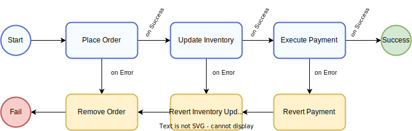
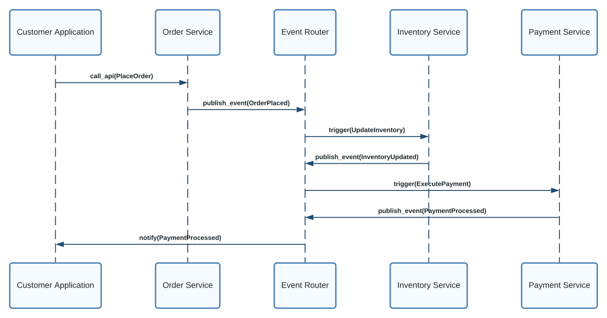
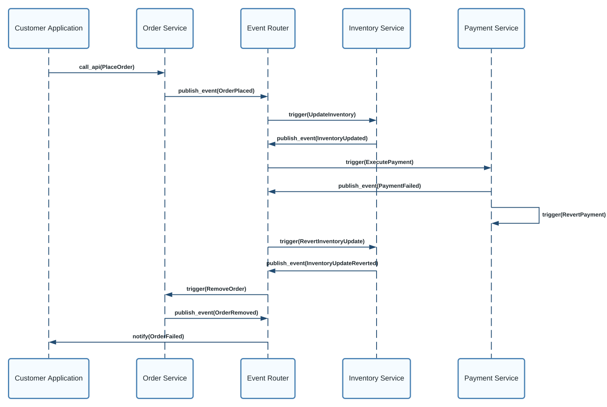
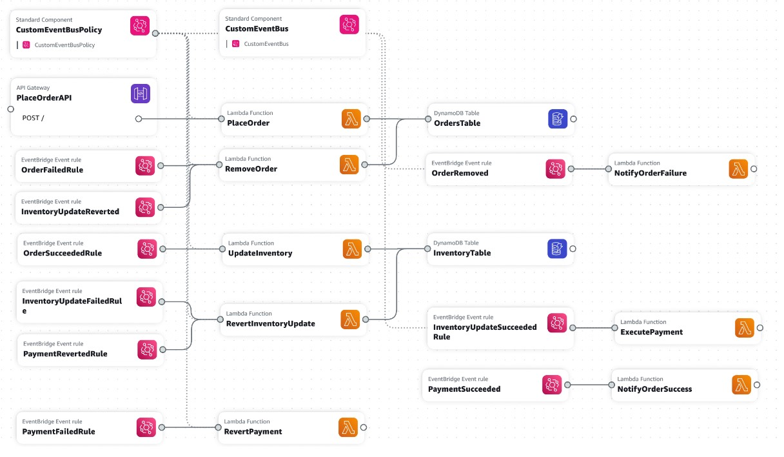

import { JomafeProfileCard } from "@site/src/components/ProfileCard"
import { FigureCaption } from "@site/src/components/FigureCaption"
import { PersonQuote } from "@site/src/components/PersonQuote"

# How to handle transactions across distributed systems

:::info

This document explains the SAGA pattern, why it matters, and how to design for it when using events and
message brokers on AWS.

:::

<JomafeProfileCard />

Managing data consistency across microservices in distributed transaction scenarios is hard. In a conventional
 monolithic architecture, data consistency is managed using ACID transactions (Atomicity, Consistency, Isolation, 
 Durability) against a single database. However, in a microservices architecture where each service has its own 
 database, maintaining data consistency across these databases becomes more complex. Local transactions within 
 each service are not enough to ensure data consistency across the entire system. As a result, a strategy is needed 
 for transactions that span across multiple services. This is where the saga pattern comes into the picture, offering 
 a solution for managing data consistency across multiple services in a microservices architecture.

## The SAGA pattern explained

The Saga pattern is used to manage data consistency across microservices in distributed 
transaction scenarios. It consists of a sequence of local transactions where each transaction updates a 
service and publishes a message or event to trigger the next transaction step. If a step fails, the saga executes compensating transactions that counteract the preceding transactions.



### Features

1. **Transaction coordination**: SAGA enables orchestrating multi-step workflows across disparate services to complete an end-to-end transaction, while coordinating commits and rollbacks.  
2. **Remediation and rollback**: SAGA workflows leverage compensation and rollback mechanisms to maintain system integrity if any step fails, keeping operations fault-tolerant.
3. **Decentralized actions**: SAGA allows building decentralized applications that coordinate actions spanning multiple, distributed services to progress transactions. 
4. **Async execution**: SAGA supports asynchronous execution of workflow steps, enabling concurrent processing across services for improved performance.
5. **Standardized error handling**: SAGA standardizes error handling across workflow steps and services, ensuring consistent exception management.
6. **Horizontal scalability**: SAGA workflows can scale horizontally to manage complex transactions across multiple services, by decomposing them into smaller, parallelizable steps.

### Implementation strategies: Choreography vs Orchestration

With **Choreography** each service produces and listens to other
service’s events and decides, from the event content, if an action
should be taken or not. An event router is used to asynchronously 
exchange messages between the distributed components.

A simple example of how to implement a saga pattern using choreography could be:
1.	Service A initiates a saga by publishing an event, say OrderPlaced.
2.	Service B listens for the OrderPlaced event and updates its own data accordingly.
3.	Service B then publishes an event, say InventoryUpdated.
4.	Service C listens for the InventoryUpdated event and updates its own data.
5.	If any of these steps fail, the corresponding service should publish an event to trigger compensating transactions.

With **Orchestration**, one service is responsible to drive each
participant on what to do and when. This orchestration can be done
with different tools and protocols. Workflow engine with
synchronous calls, is a classical implementation in the SOA world. 

Choreography, akin to a ballet, allows components to operate independently without a central coordinator. This fosters loose coupling, ease of maintenance, decentralized control, and asynchronous 
communication. However, it introduces complexity, challenges in monitoring, lack of visibility, 
and difficulty in troubleshooting.

On the other hand, orchestration, likened to a conductor in an orchestra, involves a central authority 
coordinating interactions. It simplifies implementation and maintenance, provides centralized control, 
visibility, and facilitates easier troubleshooting. Yet, orchestration may exhibit tight coupling, 
a single point of failure, difficulty in changing configurations, and potential overhead.

Using choreography between business domains provides flexibility and loose coupling, aligning well with the independence and evolution of distinct business capabilities. Within a business domain, orchestration may offer centralized control and simplified coordination, especially in scenarios involving complex workflows or tightly coupled components. The key is to evaluate the specific needs and characteristics of each business context to determine the most suitable coordination pattern.

### Benefits of the Saga Pattern
1.	Ensures data consistency in a distributed system without tight coupling.
2.	Allows for rollback or compensation if one of the operations in the sequence fails.
3.	Supports business logic and rules that span multiple domains and bounded contexts by defining a clear sequence of actions and events.
4.	Facilitates testing and monitoring by making each step of the transaction traceable and observable.

### Drawbacks of the Saga Pattern
1.	The orchestration pattern can become a single point of failure because it controls the entire workflow.
2.	The choreography pattern may not be a good idea in a highly complex workflow as it may get too complex at times.
3.	If your transaction involves many steps, it might be difficult to track which services listen to which events.


### General guidelines and best practices

These are some general guidelines and best practices for implementing the SAGA pattern:

- Identify operations/services that need to participate in the saga. Each operation should be idempotent and transactional.
- Define the ordering of operations and compensation logic. Model the saga as a finite state machine.
- Log key state changes and events using event sourcing. This provides an audit trail to aid recovery.
- Implement asynchronous communication between services using messaging/events. This ensures loose coupling.
- Provide mechanisms to coordinate and track progress of individual saga instances. For example, have a saga coordinator service.
- Have compensation logic that can undo previously completed operations. Make compensation actions idempotent.
- Set timeouts and have mechanisms to handle faults/retries. Sagas should eventually progress.
- Monitor and visualize saga executions using tracing, logging, health checks, etc.
- Implement mechanisms to handle non-functional requirements e.g. securing sensitive data, ensuring availability of services. 
- Test end-to-end saga flows early on, include failure scenarios. Measure KPIs related to consistency, reliability and performance.

### Example: Event-driven implementation using EventBridge

EventBridge uses events to connect application components. It processes events through event buses. An event bus is a router that receives events and delivers them to zero or more destinations, or targets. Rules associated with the event bus evaluate events as they arrive and send them to targets for processing. 

In this example, the microservices (order service, inventory service, and payment service) are implemented as Lambda functions. Order, Inventory and Payment rules match the different types of events and invoke those services interested in them.

The happy path scenario (when everything works as expected) would be this:
1.	The Order Service receives an order placement request from the client application and sends the OrderPlaced event to the EventBridge event bus. 
2.	The orders rules match the event, start the inventory service and notify the client application. 
3.	The inventory service updates the inventory and sends the InvetoryUpdated event. 
4.	The Inventory rules match the event and start the payment service. 
5.	The payment service processes the payment and sends the PaymentProcessed event. 
6.	The Payment rules match the event and send the Payment processed event notification to the listener. 



In EventBridge, events are represented as JSON objects and they all have a similar structure, with the same top-level fields. The contents of the **detail** top-level field are different depending on which service generated the event and what the event is. The combination of the **source** and **detail-type** fields serves to identify the fields and values found in the detail field. 

To identify which services are triggered to process specific events, EventBridge uses rules. A rule matches incoming events using **event patterns** and sends them to targets for processing. A target is a resource or endpoint that EventBridge sends an event to when the event matches the event pattern defined for a rule. To deliver event data to a target, EventBridge needs permission to access the target resource. 

For instance, in step 2 in the example above, we define an EventBridge rule to match events published by the Order Service where the order status is "SUCCEEDED" using the following **event pattern**:

```
{
  "source": [
    "custom_application.order_service"
  ],
  "detail-type": [
    "Order Status Change"
  ],
  "detail": {
    "order-status": [
      "SUCCEEDED"
    ]
  }
}
```

In case there was an error while placing the order, another rule with the following event pattern would match the failure event and send it to the RemoveOrder lambda function.

```
{
  "source": [
    "custom_application.order_service"
  ],
  "detail-type": [
    "Order Status Change"
  ],
  "detail": {
    "order-status": [
      "FAILED"
    ]
  }
}
```

Alternatively, when there is an issue (i.e. with the payment), the EventBridge rules start the compensatory transactions to revert the previous data updates to maintain data consistency and integrity:



The following picture summarizes the resources defined in this [CloudFormation template](./template.yaml) which can be used to implement this sample scenario using a custom EventBridge bus and Lambda functions to process each event type:



### Risks

Some potential risks with using the saga pattern in distributed systems:
- **Data consistency** - Sagas are designed to maintain data consistency across microservices, but if a step fails or times out, data can be left in an inconsistent state. Extra effort is needed to detect and compensate failed steps.
- **Rollback complexity** - Rolling back a long saga with many steps can be complex, especially if external systems are involved. The compensation logic needs to carefully undo the work while avoiding new errors.
- **Performance overhead** - The saga coordination process can add processing overhead as transactions propagate across process boundaries. The extra coordination messages can impact performance.
- **Replay attacks** - A replay of an old transaction may trigger the saga to rerun when it shouldn't. Symbols or ids are needed to detect duplicate requests.
- **Transactional backpressure** - Too many transactions executing sagas concurrently could overload services and cause timeouts, failures, and strain resources.
- **Debugging complexity** - With coordinations spanning multiple services, debugging failed sagas can be more difficult to trace and isolate root causes. More instrumentation is necessary.
- **Side effects** - Compensation logic could have unintended side effects. A rollback in one system may confuse other systems if not designed carefully.

### Conclusion

Overall, sagas trade strict atomicity for coordination complexity. Understanding these risks and taking preventative measures during implementation is key to using sagas effectively, as well as thorough testing of fault scenarios.
