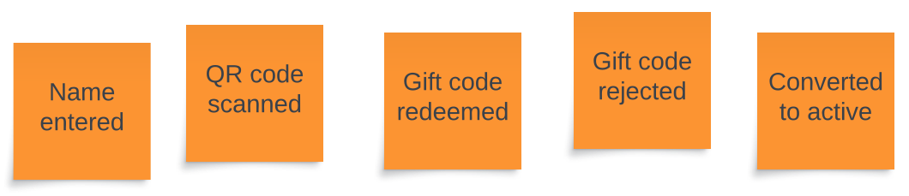

{/* Copyright Amazon.com, Inc. or its affiliates. All Rights Reserved. */}
{/* SPDX-License-Identifier: CC-BY-SA-4.0 */}

import { Quote } from "@site/src/components/Quote"

import { Definition } from "@site/src/components/Definition"

The first step in any EventStorming session is crowdsourcing events. Individuals brainstorm events
and write them down on orange sticky notes. To get started, think about the first and last events in
your problem domain.

As an example, when modeling "onboarding users" the first domain event could be `name entered` and
the last event may be `converted to active`. There will be many more events between these starting
and ending events. Everyone's job is to brainstorm events without worrying about naming them right,
duplicates or ordering. Don't over-complicate it! Many people worry about getting things "right".
What's most important at this phase is "doing."

However, this begs the question: what is an event? In EventStorming and event-driven architecture we
define an event as:

<Definition term="Domain event" wordType="noun">
  Something that a domain expert cares about.
  An immutable fact that has occurred in the past.
</Definition>

Events are written in the past tense. They are facts that have already occurred and cannot be
changed. What constitutes a domain event is defined by you and your domain experts. What may be
irrelevant in one problem domain may be important in another.

Is a user scrolling the to bottom of a webpage a domain event? It depends. If you are operating in
the domain of e-commerce, it's unlikely you may care when a user scrolls to the bottom of a page.
However, if you're building a web analytics platform, a user moving to the bottom of the page may be
very important. It's up to you and the other domain experts to define what is or is not a domain
event.

Add a time constraint when starting the workshop and creating events. 10 or 15 minutes will usually
suffice to get started. What's most important is participation from everyone and building momentum.
When doing a Big Picture session more time isn't better. With more time, people may feel like they
need to go into more detail. Remember that a Big Picture session is just that...big picture! It can
be a challenge but try to save the details for later.

Once the team has created some events it's time to sequence them. Read the next section to learn how
to run this next phase.
