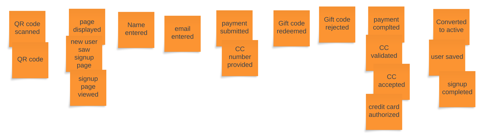
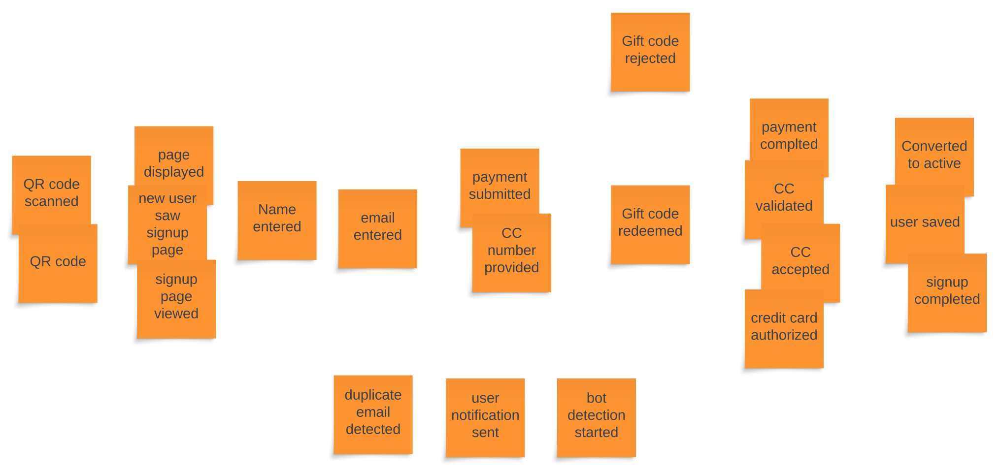

{/* Copyright Amazon.com, Inc. or its affiliates. All Rights Reserved. */}
{/* SPDX-License-Identifier: CC-BY-SA-4.0 */}

Once people have created enough events it's time to sequence them. Sequencing is nothing more than
talking through the order that the events occur relative to one another. While this process sounds
it should spur many conversations and debate.

During this stage there will be duplicate events that are written similarly, or completely
different. The group needs to discuss the language used in the events and agree upon words or
phrases, what events are duplicates, and where events live along the timeline.

In the example below there are four different events that relate to a credit card payment being made
and accepted. They all have the same theme, but use different language. It also may make sense to
consolidate multiple events with one event that represent some amount of complexity. It could also
make sense to take a stack of events that you may think are the same thing, and split them up into
multiple events using slightly different language.

There are no absolute rules with EventStorming and sequencing! The most important part of the
process is that domain experts explore, learn, and understand together.

A question that will undoubtedly come up is how to handle parallel flows or logical branches. "We do
_this_ in some cases, but it depends on _that_." "This event happens when this other thing fails,
and it doesn't happen often, but it's really important." Sometimes people may call this the "sad
path" meaning something that happens during an error. A simple way of dealing with this is to put
the parallel events above or below the "happy path" flow.

In this example imagine a duplicate email is detected during the new user flow. A duplicate email
could trigger a notification being sent to the user along with a security scan. Similarly, the
sequence started with `Gift code rejected` coming after `Gift code redeemed`. Moving
`Gift code rejected` above `Gift code redeemed` is a simple way to not lose detail and explore what,
if anything, happens when an invalid gift code is entered.

During a Big Picture sessions it's often sufficient to capture just the big events and not worry too
much about all of the different permutations and paths. Many details will start to show up as you
get into more depth in Process and Detail level EventStorming sessions.
