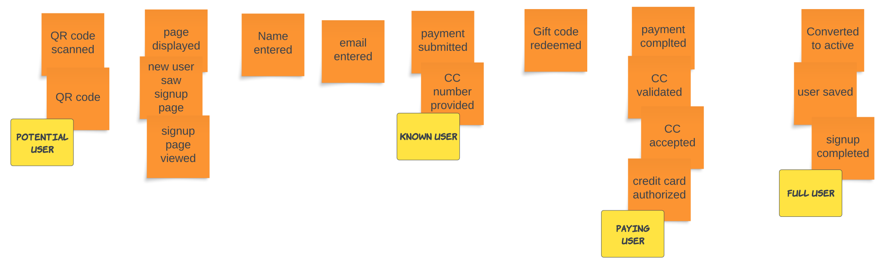

{/* Copyright Amazon.com, Inc. or its affiliates. All Rights Reserved. */}
{/* SPDX-License-Identifier: CC-BY-SA-4.0 */}

After an initial sequence of events it's time to start adding people. You may see "people" called
different things in different EventStorming resources such as:

- Actors
- Agents
- Personas

The idea is the same: think through who is the target of a given event. This may or may not be the
same person who creates the event. Another way to think about it is who the event serves. Yet
another trick is to use a movie as an analogy. In any scene, there is a central character who is the
star. Sometimes there are multiple characters central to a particular scene.

In this phase, add actors when they show up or change, not at every event. In the user sign up
example, your inclination may be to think that the only person involved is a `customer` or `user`.
Think about adding an adjective in front of people. What type of `user` is involved in these events?

In this example a `potential user` is the central character from the start of the process until they
enter credit card information. The reason for this is that we don't know anything about the user
except for perhaps their username and email address. They haven't signed up or made any commitment
to sign up for our service. For those reasons, they are a `potential user`.

You can follow this logic to the end when they finally become a `full user`. For technical teams,
think (just for a moment) of how to implement this. Would a `potential user` and `known user` have
the exact same attributes? Would you treat them the same in your code? If you implemented a single
`User` object in your code, think about all of the optional attributes you'd need to add in order to
represent a `User` across the entire timeline. People often don't get specific enough.

:::warning

Don't go too far down this path of thinking of implementation at this stage. But, systems thinking
can help you add more specificity to the people involved in the timeline. Ultimately more
specificity will help you to identify boundaries.

:::
