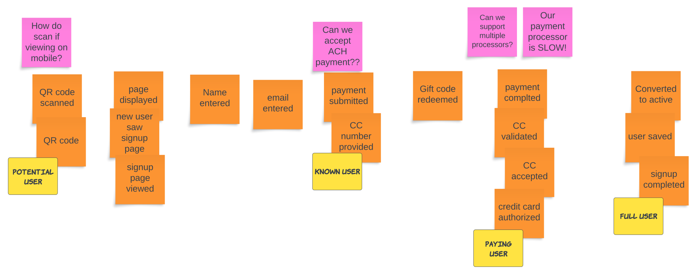

{/* Copyright Amazon.com, Inc. or its affiliates. All Rights Reserved. */}
{/* SPDX-License-Identifier: CC-BY-SA-4.0 */}

Questions or challenge can be captured using pink sticky notes. These are known as "hotspots."
Whenever something arises that you cannot answer now, or that you know is a problem, capture it as a
ping sticky note and place it on the board near the event that it relates to.

Hotspots are a good tool to time box discussions that seemingly have no end. After a few minutes of
discussion a facilitator may ask participants to capture a question as a hotspot and move on.
Conversations are valuable, but a conversation that goes on for 30 minutes without a resolution or
decision doesn't help. The team will need to come back to questions in the hotspots after the
workshop.

It's possible that a team may get started with writing and sequencing events and end up with more
pink than orange sticky notes. This is a clear sign that the team has a lot more work to do before
running a successful EventStorming session. Having more questions than answers could also be a sign
that you need more domain experts in the room.
