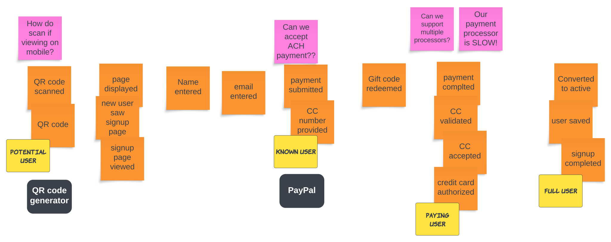

{/* Copyright Amazon.com, Inc. or its affiliates. All Rights Reserved. */}
{/* SPDX-License-Identifier: CC-BY-SA-4.0 */}

import { PersonQuote } from "@site/src/components/Quote"

Next are external systems that your process uses or integrates with. A classic example is a payment
processor. The example user sign-up flow delegates the work of validating and accepting payment to a
payment processor like PayPal or Stripe.

EventStorming participants are often confused what constitutes a "system." Is a system what you're
building? Or, is it another internal tool or microservice? The following definition may help.

<PersonQuote author="Alberto Brandolini" url="https://leanpub.com/introducing_eventstorming">
  An External System is whatever we can put the blame on
</PersonQuote>

An external system can be anything you depend on that you do not directly control, like a 3rd party
SaaS application. A system can also be something that you or your organization own and operate but
is outside of the application you're modeling, like a user management system.

In the example above, the payment processor is a 3rd party system that we integrate for payments.
The QR code generator could be an external system that another team in the company builds and runs.
The QR code generator could also be a microservice that our team has built but that we treat as a
3rd party system for the "user onboarding" flow.
