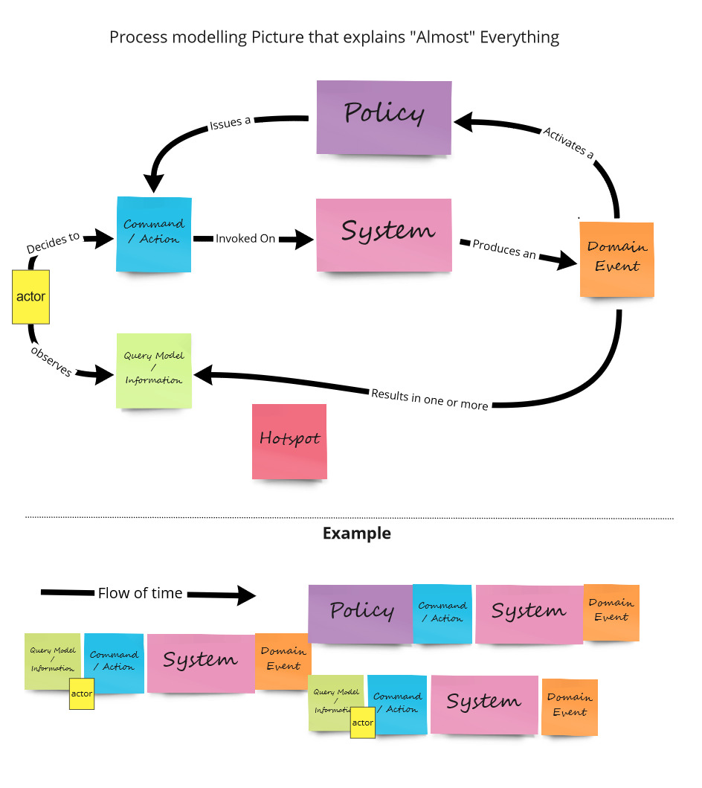
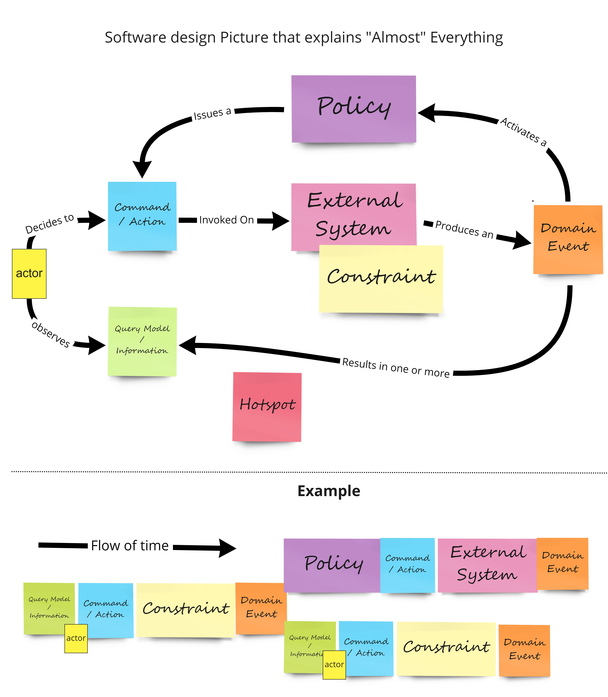

{/* Copyright Amazon.com, Inc. or its affiliates. All Rights Reserved. */}
{/* SPDX-License-Identifier: CC-BY-SA-4.0 */}

import { PersonQuote } from "@site/src/components/Quote"
import { FigureCaption } from "@site/src/components/FigureCaption"
import useBaseUrl from "@docusaurus/useBaseUrl"

export const BooksLayout = (props) => {
    const flexStyle = {
        display: "flex",
        alignItems: "center",
        justifyContent: "center",
        marginBottom: "20px",
      }
    const rowStyle = { flex: "1", textAlign: "center" }

    const BookColumn = ({book}) => {
        return (
          

            <h2 style={{marginBottom: 0}}>{book.title}</h2>
            
by {book.author}

            
            

              <h3><a href={book.link}>{book.link}</a></h3>
            

          

        )
    }

    return (
        

            <BookColumn book={props.book1}/>
            <BookColumn book={props.book2}/>
        

    )

}

This guide gave you a brief introduction to running a Big Picture EventStorming session and the
benefits that it can provide. There is much more to EventStorming than what's captured here. Still,
the content here should give you an idea of what EventStorming entails and what you can expect if
you are looking to gain clarity across your organization.

One of the Amazon leadership principles is "Learn and be curious." Don't be intimidated or
overwhelmed by EventStorming. You won't get it "right" the first or 15th time because there is no
"right" way of doing it, only guidelines. What may be best for one group may not be for another.
Lean into the chaos and confusion that EventStorming creates and starting having conversations to
gain clarity across your team(s).

:::tip

If you are an AWS customer, ask your account team to run an EventStorming session with you! A number
of AWS Solutions Architects and Technical Account Managers are capable facilitators and can help you
and your team.

:::

## Resources

You can learn much more about EventStorming by reading the following ebooks, both on LeanPub.

<BooksLayout
  book1={{
    title: "Introducing EventStorming",
    author: "Alberto Brandolini",
    bookCoverImage: "/img/eventstorming/eventstorming-book-cover.jpeg",
    qrCodeImage: "/img/eventstorming/introducing-es-qr.png",
    link: "https://s12d.com/es",
  }}
  book2={{
    title: "The EventStorming Handbook",
    author: "Paul Rayner",
    bookCoverImage: "/img/eventstorming/eventstorming-handbook-cover.png",
    qrCodeImage: "/img/eventstorming/es-handbook-qr.png",
    link: "https://s12d.com/es-handbook",
  }}
/>

## What next?

### Process modeling

After a Big Picture session is run you can dive deeper into a particular area of the board using
process-level sessions. In our example, we could dive into the "payment verification" subdomain to
add more details, clean up any confusion, answer questions captured through hotspots and otherwise
go into more depth.

A process-level EventStorming session introduces two additional concepts:

- Policies
- Read/query models

Don't overthink or be intimidated by this. The additional detail and concepts may look and sound
complicated, but they are merely tools meant to drive collaboration and discussion.

<PersonQuote author="Brian Zambrano">
  EventStorming may be a well-defined process, but it can (and should) be loosely applied.
</PersonQuote>

<FigureCaption>
  "Process modeling Picture that explains \"Almost\" Everything" from [EventStorming Glossary &
  Cheat sheet](https://github.com/ddd-crew/eventstorming-glossary-cheat-sheet), under CC-BY-SA-4.0
  license
</FigureCaption>

### Design modeling

Once process modeling feels like it's done enough you can go another level deeper with your
technical team to start thinking through how you may implementation such a process.

This too introduces another concept, the often ambiguous and confusing "aggregate" or "constraint."

<FigureCaption>
  "Software design Picture that explains \"Almost\" Everything" from [EventStorming Glossary & Cheat
  sheet](https://github.com/ddd-crew/eventstorming-glossary-cheat-sheet), under CC-BY-SA-4.0 license
</FigureCaption>

### Building

Once you go through the entire process from Big Picture all the way to a Design-level EventStorming
sessions you and your team will be in a great position to start building. At this phase, you will
have enough information to get starting using your preferred development process: setting up a
sprint, scrum, writing user stories or simply building a small POC.

Since EventStorming models an non-trivial process and uses domain events as the language, you have a
big head start when adopting an event-driven architecture strategy. The boundaries you identified
during EventStorming should guide your design and thinking as you begin to create independent
systems and services that communicate through events. EventStorming and domain-driven design aren't
silver bullets; you (still) need to think deeply as you start and continue building. However, you
will have a big advantage having gone through multiple collaborative EventStorming sessions and
having a shared understanding with your colleagues.

_Now go build!_ 🚀
