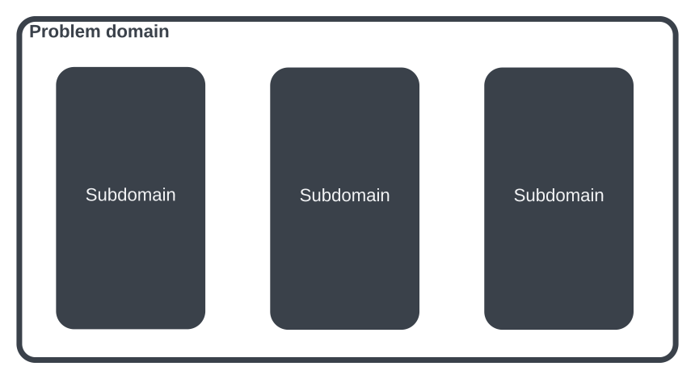
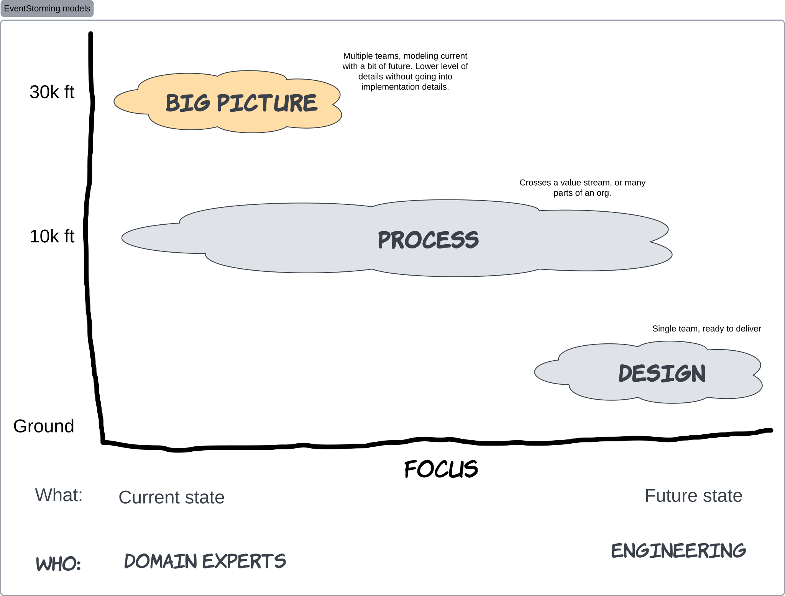

{/* Copyright Amazon.com, Inc. or its affiliates. All Rights Reserved. */}
{/* SPDX-License-Identifier: CC-BY-SA-4.0 */}

import { PersonQuote } from "@site/src/components/PersonQuote"

_"Where do I start?"_ is a question that often arises when discussing or thinking about adopting
event-driven architectures. While event-driven architectures is seemingly simple to get started,
there are many considerations when adopting EDA as a strategy for your business.

It's not uncommon for teams within company to each have their own understanding their problem
domain. When domain experts and technical teams are misaligned, it's hard or impossible to innovate
and move quickly because of miscommunications.

<PersonQuote
  author="Alberto Brandolini, EventStorming creator"
  url="https://www.eventstorming.com/book/"
>
  It’s developers’ (mis)understanding, not domain experts’ knowledge, that gets released in
  production.
</PersonQuote>

:::tip

How can you ensure that your domain experts’ knowledge is what your teams will build and ship? _Turn
your developers and teams into domain experts._

:::

A problem domain is the area you and your company are working. You create solutions within this
domain to provide value to your customers and to make money or exist as a business entity. Most
problem domains are complex enough to have sub-domains within them. An overly simplistic example is
e-commerce. If you are working in the problem domain of e-commerce, shipping, billing and customer
support would be examples of sub-domains.

The natural question is how do you identify, define and break down a domain and its subdomains so
that you can solve the challenges in each of them?

EventStorming is a workshop-based approach used to break down a non-trivial problem domain with the
goal of coming to a shared understanding across an organization or team.

EventStorming facilitates a shared understanding by getting domain experts in same physical or
virtual room to map a business process collaboratively. Through this exercise, people can ask
questions, sequence events in the business process, call out challenges and together build a model
of how their business process works, or should work.

EventStorming focuses on _understanding_ vs. _solutioning_. Through EventStorming, you can find
sub-domains, identifying bounded contexts and most importantly discover these collaboratively with a
cross section of your business. During the process you use domains events as a language to describe
the process that you will model. In event-driven architectures, you can use these boundaries and
events as a starting point when you start to build independent and loosely couples systems.

:::tip

_EventStorming is a technique that is not limited to building event-driven architectures, but it's a
natural fit._ If you're working on a monolithic application or tightly coupled HTTP-based
microservices, EventStorming is useful. If you're building using event-driven architecture, we
recommend starting with an EventStorming session.

:::

There are different types of EventStorming sessions with different participants and different
outcomes.

- **Big Picture**: Designed to map a large and complex system or process. This is high level with
  the majority of the participants being domain experts. Job family is mostly irrelevant, as long as
  people have a good understanding of the problem domain. The focus of a Big Picture session is
  largely the _current state_ rather than future state.
- **Process**: This is the next level down in terms of details. Once a sud-domain or boundaries have
  been identified in a Big Picture session, a process-level session can be used to go into more
  details. This blends the current state with some _future state_, and may involve more engineers.
- **Design**: A design-level session is down on the ground once a single team has a good
  understanding of a system or process and is getting ready to build. This focuses on what you _will
  be building_, or future state. Participants include the technical delivery team with fewer
  non-technical stakeholders.

Read more to learn about how to use EventStorming and the benefits it provides.
