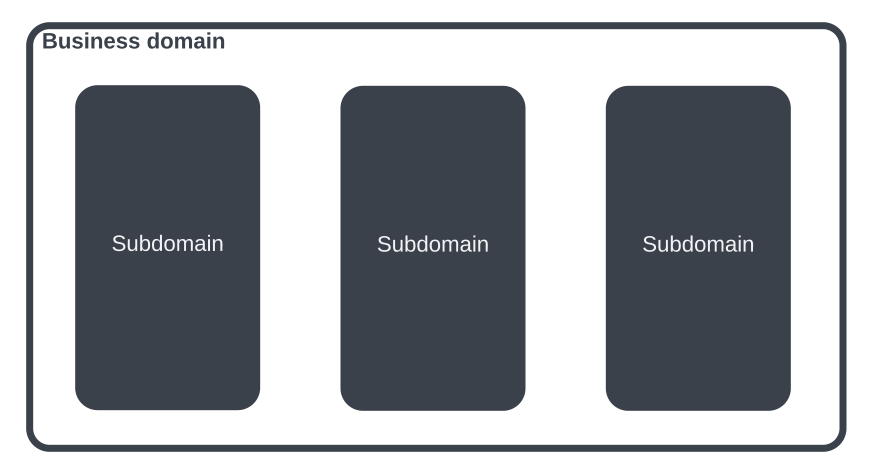

{/* Copyright Amazon.com, Inc. or its affiliates. All Rights Reserved. */}
{/* SPDX-License-Identifier: CC-BY-SA-4.0 */}

import { PersonQuote } from "@site/src/components/Quote"
import { FigureCaption } from "@site/src/components/FigureCaption"
import { BrianProfileCard } from "@site/src/components/ProfileCard"

_"Where do I start?"_ is a question that often arises when discussing or thinking about adopting
event-driven architectures. While event-driven architectures is seemingly simple to get started,
there are many considerations when adopting EDA as a strategy for your business.

<BrianProfileCard />

## Why EventStorming?

It's not uncommon for teams within company to each have their own understanding their problem
domain. When domain experts and technical teams are misaligned, it's hard or impossible to innovate
and move quickly because of miscommunications.

Have you worked at a company where a product team comes up with a list of requirements and throws
that list to the developers to build? That is an all-too-familiar scenario that typically doesn't
lead to success. When the domain experts and engineers operate in their respective silos details are
lost and assumptions are made . The end result is a product that may not solve the business problem,
technical debt that makes adaption hard or impossible and frustrations across an organization.

EventStorming is a technique that aims at bridging these gaps between business and engineering to
reach a shared understanding. A side effect of this shared understanding is _better_ software that
can _adapt_ to changes and solves real-world problems for customers.

  <iframe
    width="560"
    height="315"
    src="https://www.youtube.com/embed/FG4UOoEJvBc?si=lPCYKxFDTiCMSBdC"
    title="YouTube video player"
    frameborder="0"
    allow="accelerometer; autoplay; clipboard-write; encrypted-media; gyroscope; picture-in-picture; web-share"
    allowfullscreen
  ></iframe>

<PersonQuote
  author="Alberto Brandolini, EventStorming creator"
  url="https://www.eventstorming.com/book/"
>
  It’s developers’ (mis)understanding, not domain experts’ knowledge, that gets released in
  production.
</PersonQuote>

:::tip

How can you ensure that your domain experts’ knowledge is what your teams will build and ship? _Turn
your developers and teams into domain experts._

:::

## Exploring boundaries

A business domain is the area you and your company are working. You create solutions within this
domain to provide value to your customers and to make money or exist as a business entity. Most
business domains are complex enough to contain subdomains. An overly simplistic example is
e-commerce. Shipping, billing and customer support are examples of subdomains within the e-commerce
business domains. Each subdomain may itself have multiple boundaries inside that need specific
solutions in order to provide business value. For example, the customer support subdomain may
contain multiple software systems to handle returns, billing, and website orders.

The natural question is how do you identify, define and break down a domain and its subdomains so
that you can solve the challenges in each of them? EventStorming can help. The outcomes from
EventStorming sessions vary depending on why type of session you are running, but the goal is always
the same: to come to a shared understand of a business process and model so that you can build and
deliver the right solution for your customers.

:::note[What is EventStorming?]

<h2>
  EventStorming is a workshop-based approach used to break down a non-trivial business domain with
  the goal of coming to a shared understanding across an organization or team.
</h2>

:::

## How to run EventStorming

EventStorming facilitates a shared understanding by getting domain experts in same physical or
virtual room to map a business process collaboratively. Through this exercise, people can ask
questions, sequence events in the business process, call out challenges and together build a model
of how their business process works, or should work.

EventStorming focuses on _understanding_ vs. _solutioning_. Through EventStorming, you can find
subdomains, identifying bounded contexts and most importantly discover these collaboratively with a
cross section of your business. During the process you use domains events as a language to describe
the process that you will model. In event-driven architectures, you can use these boundaries and
events as a starting point when you start to build independent and loosely couples systems.

:::tip

If you're working on a monolithic application or tightly coupled HTTP-based microservices,
EventStorming is useful. However, if you're using or plan to adopt an event-driven architecture
strategy, we strongly suggest starting with EventStorming.

_EventStorming is a technique that is not limited to event-driven architectures, but is a natural
fit._

:::

## Flavors of EventStorming

<FigureCaption>
  Graphic showing three different types of EventStorming sessions, their focus and who participates.
</FigureCaption>

There are different types of EventStorming sessions with different participants and different
outcomes.

- **Big Picture**: Designed to map a large and complex system or process. This is high level with
  the majority of the participants being domain experts. Job family is mostly irrelevant, as long as
  people have a good understanding of the business domain. The focus of a Big Picture session is
  largely the _current state_ rather than future state.
- **Process**: This is the next level down in terms of details. Once a subdomain or business
  boundaries have been identified in a Big Picture session, you can use a process-level session to
  go into more depth. This flavor of EventStorming blends the current state with some _future
  state_. It may involve more engineers.
- **Design**: A design-level session is down on the ground once a single team has a good
  understanding of a system or process and is getting ready to build. This focuses on what you _will
  be building_, or future state. Participants include the technical delivery team with fewer
  non-technical stakeholders. Once this is done teams can write user stories, plan a sprint or
  otherwise start the development process. A team will be armed with an agreed upon understanding of
  a business process which serves as their template for a proof-of-concept or first iteration.

## What's next?

Continue reading to learn how to use EventStorming and the benefits it provides. The following
sections are sequenced and offer a pathway to run a Big Picture session.
